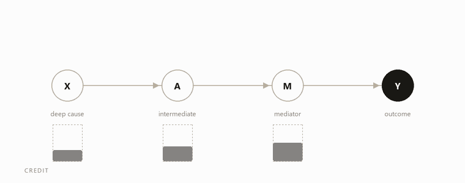
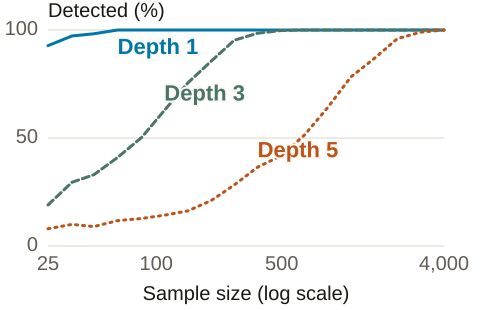

# Causal SHAP: a benchmark using a spaceflight risk graph

[](https://github.com/ahhatype/causal-shap-spaceflight-renal-stones/actions/workflows/python-tests.yml)
[Reproducibility guide](REPRODUCIBILITY.md) · [Teaching companion](docs/classroom/README.md) · [Technical notes](docs/technical/path-length-and-response-shape.md)

A prediction ranking explains a fitted model. To assess what would happen
after changing a variable, we also need assumptions about the causal
relationships. This study compares those answers using synthetic data based
on NASA's renal-stone graph, with numerical mechanisms chosen by the study team.

<p align="center"></p>

With full mediation and exact measurement, an ideal predictor can use M
alone even though changing X affects Y through A and M. The bars illustrate
this distinction; they are not fitted SHAP values or effect sizes, and
their totals are not comparable across phases.

## The central workflow

These seven stages connect prediction explanations to causal analysis.
The simulations test parts of the workflow; the complete sequence has not
been validated. A supplied graph can be evaluated directly, and causal
analysis does not require running SHAP first.

| Stage | Purpose | Current evidence |
| --- | --- | --- |
| 1. Define the study | Specify the outcome, graph assumptions and intervention contrasts. | Two renal simulations with known mechanisms. |
| 2. Fit and explain predictions | Compare what fitted models credit. | Five model–explainer pairings on the working subgraph. |
| 3. Examine candidate graphs | Assess structures under discovery assumptions. | A disconnected-outcome diagnostic; broader comparisons pending. |
| 4. Reconsider excluded candidates | Investigate discarded variables and filter noise. | Detector and filter placeholders; no evaluated results. |
| 5. Review graph assumptions | Assess biological evidence and unresolved directions. | Scripted revisions only; human review pending. |
| 6. Follow changes through the graph | Calculate causal attributions and intervention contrasts. | Ordering-only comparison and a separate propagation prototype. |
| 7. Evaluate feasible actions | Estimate benefit, uncertainty, feasibility and cost. | Scaffold only; outside completed article scope. |

The [workflow and evidence map](docs/playbook/central-workflow.md) connects
these stages to the examples, implementations and assumptions.

## Worked example and simulation

Consider M = 0.6X + eM and Y = 0.6M + eY, with independent mean-zero
disturbances, x = 1 and eM = 0.2. The ideal predictor is f = 0.6M.

| Quantity | X | M | What it answers |
| --- | ---: | ---: | --- |
| Predictive model-interventional Shapley credit | 0 | 0.48 | Which inputs contribute to this prediction? |
| Symmetric structural Shapley credit | 0.18 | 0.30 | How does a specified causal game distribute credit? |
| Mean effect of setting X from 0 to 1 | 0.36 | — | How much does the expected outcome change? |

Both credit allocations sum to the prediction relative to a zero background.
The intervention contrast is a different quantity. The [worked calculation](docs/classroom/educator-guide.md#answer-key)
defines the games and derives the numbers. This is an exact teaching example,
separate from the renal simulations and their attribution methods.

The renal simulations add competing predictors, multiple pathways, an
interaction and a binary outcome. NASA supplies topology; effect sizes
come from the chosen simulation mechanisms.

| Testbed | Finding | Evidence and limits |
| --- | --- | --- |
| Five-node teaching stress test | An outcome descendant receives 45.6% of ordinary SHAP mass despite zero total effect. | Deliberately constructed teaching case, separate from the renal simulations. [Record](docs/full_dag/RESEARCH_RECORD.md). |
| 14-node working subgraph | Credit shifts in both directions by chain and model. Gaussian PC isolates the binary outcome at n = 1,000. | One seed. Scripted revisions produce mixed changes across methods; no human reviewed the rounds. [Baseline results](docs/step04_results.md), [scripted revisions](docs/step06_results.md). |
| 51-node source DAG | Ordinary versus ordering-only Kendall's tau: 0.506 / 0.528, with no detected difference. A propagation prototype reaches 0.794. | The prototype receives known mechanisms and uses a different budget, without repeated-seed uncertainty; its score does not establish method superiority. [Research record](docs/full_dag/RESEARCH_RECORD.md). |

Kendall's tau measures agreement with simulated total-effect rankings. The
two renal graphs use separate generators and intervention ranges, so their
scores are not one head-to-head comparison. See [comparison inputs and intervention definitions](docs/playbook/central-workflow.md#what-information-each-comparison-receives).

## Path length and response shape



In a chain with coefficient 0.6 on every edge, longer paths transmit smaller
effects, making marginal slopes harder to detect. This is a teaching
experiment, not a measure of graph-discovery accuracy. Greater path length
does not always mean a smaller effect, and a direct arrow need not describe
a straight-line response.

The [technical note](docs/technical/path-length-and-response-shape.md) gives
the derivations, detection rule, nonlinear examples and spline context,
with [BibTeX references](docs/references/technical-companion.bib).
Nonlinear robustness of the renal comparisons remains pending.

## Teaching materials

The [teaching companion](docs/classroom/README.md) includes an interactive
calculation, [student worksheet](docs/classroom/worksheet.md),
[educator guide and answer key](docs/classroom/educator-guide.md), and a
Python lab requiring no additional packages. It supports a 50-minute lesson
or a 90-minute lab.

Download and extract the repository, then open `docs/classroom/index.html`.
To check the calculations:

```bash
python docs/classroom/lab.py --check
```

## Quickstart

For the research code, create a Python 3.13 environment:

```bash
py -3.13 -m venv .venv
.venv/Scripts/python -m pip install -e ".[discovery,workbench,dev]"
.venv/Scripts/python -m pytest
```

On macOS or Linux use `python3.13` and `.venv/bin/python`.
The [reproducibility guide](REPRODUCIBILITY.md) covers the R pipelines,
frozen-output validation, depth experiment and downloadable teaching kit.
The [research apps](apps/README.md) provide interactive exploration.

## Protocol

The [13-step protocol](docs/playbook/protocol.md) lists implementation paths
and completion status. The [documentation index](docs/README.md) covers
methods, results, references and provenance; [contributor orientation](ORIENTATION.md)
locates the source files and development priorities.

## License

[GPL-3.0-or-later](LICENSE). See [third-party notices](THIRD_PARTY_NOTICES.md)
for code provenance. External source material retains its original terms.
