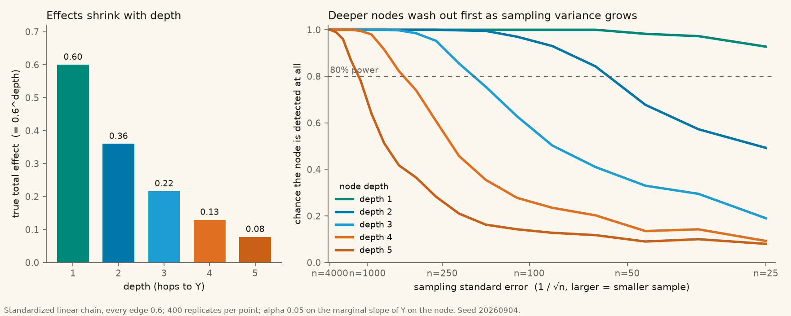

# Two goals, two playbooks: reframing the paper around intervention

**Status:** framing memo, 2026-09-03. Written from the 1 September 2026
whiteboard notes ([transcription](../notes/2026-09-01-whiteboard-transcription.md)),
the Target DAGs research record ([`../full_dag/RESEARCH_RECORD.md`](../full_dag/RESEARCH_RECORD.md)),
and the working-subgraph results (`docs/step04_results.md`, `docs/step06_results.md`).
Citations are keyed to [`../references/claims-to-citations.md`](../references/claims-to-citations.md).
This memo is scaffolding for the human-written introduction and discussion. It
is not article text.

## 1. The reframing in one paragraph

Modeling for prediction and modeling for intervention are different jobs with
different recipes. Harrell's *Regression Modeling Strategies* separates them
at the start (section 1.1: hypothesis testing, estimation, prediction) and
gives each its own strategy (sections 4.12.1 through 4.12.3); Shmueli (2010)
and Hernán, Hsu and Healy (2019) make the same cut from the statistics and
epidemiology sides. Explainable-AI practice runs the prediction playbook by
default: fit the best predictor, explain it with SHAP, read the ranking as a
list of what matters. That default is fine for prediction. For intervention
it fails in a specific, structural way: a mediator can screen off its
ancestors for prediction while still transmitting their effects, so
predictive credit pools near the outcome and the upstream nodes an
intervention would have to touch drop out of the ranking. The intervention
playbook therefore has to cast a wider net, deliberately re-admitting
candidate nodes the predictor discarded, and then prune that wider set with
structural reasoning rather than with predictive importance. The paper's
methods are the tools for the two halves of that sentence: a detector for
finding deeper nodes, and a filter for pruning them honestly.

## 2. Why the net has to be wider

The Markov argument from the Target DAGs record carries over unchanged. For
the chain X -> M -> Y with M = aX + e_M and Y = bM + e_Y, the outcome is
independent of X given M, so the Bayes predictor uses M alone and the
Shapley dummy axiom lets ordinary SHAP assign X zero credit. The intervention
effect of X is still ab. Heskes et al. (2020) and Wang, Wiens and Lundberg
(2021) each build a method around this mismatch; Janzing, Minorics and
Blöbaum (2020) show the reference distribution behind "dropping" a feature is
itself a causal choice.

The two testbeds already show the consequence at two scales:

| Testbed | What predictive attribution did | Record |
| --- | --- | --- |
| Five-node teaching DAG | Put 45.6% of credit on a node caused by the outcome whose total effect is 0 | `docs/full_dag/RESEARCH_RECORD.md` |
| Full 51-node renal DAG | Seven of 28 ancestors received exactly zero TreeSHAP credit; `medical_prevention_capability` ranks 4 of 28 in the frozen truth and tied-last under every predictive arm | `docs/full_dag/RESEARCH_RECORD.md` |
| 14-node working subgraph | Four of five explainer pairings inverted the `nutrients_risk -> urinary_oxalate_excretion -> urine_chemistry` chain, crediting the parent over its own mediator | `docs/step04_results.md` |

The whiteboard's phrase for the mediator taking the ancestor's credit is
"stolen valor." That is the narrow failure the paper is about. "Other
problems" (confounders by indication, colliders) are real but secondary here.

## 3. Why the wider net is dangerous: depth, precision, and noise

Casting a wider net admits deeper nodes, and deeper nodes are harder to
adjudicate. Three effects compound, and the notes name them as experiments
E1 through E3.

**Effects shrink with depth.** In a linear structural model the total effect
of a node on the outcome is the sum over directed paths of the product of
edge coefficients along each path (Wright 1934; Bollen 1987; Sobel 1987). In
standardized units with coefficients below one in magnitude, every extra hop
multiplies the effect by a fraction. Deeper nodes therefore carry smaller
total effects, and the sample size needed to detect a product of
coefficients rises steeply as either factor shrinks (Fritz and MacKinnon
2007). The whiteboard sketch of sensitivity falling with node count is this
argument drawn as a curve: deeper nodes need higher sensitivity to be seen at
all. No paper states "geometric attenuation with depth" as a theorem; the
paper should derive it from the product rule and cite the power results, and
should note Kenny and Judd (2014) as a caveat that indirect-effect tests do
not always lose power relative to total-effect tests.

**Noise accelerates the washout.** Measurement error in a mediator biases
the indirect effect through it toward the null (VanderWeele, Valeri and
Ogburn 2012); regression dilution does the same for any error-laden
predictor (Hutcheon, Chiolero and Hanley 2010). A deep node's effect reaches
the outcome only through several such attenuations. The notes' phrase
"deeper nodes wash out faster, accelerated by noise" is the compound of the
two effects above. E3 (the notes' "sinking into noise"; the words beside it,
"Giffen good", were a side doodle about a related idea and not part of the
experiment) is the regime where a real deep node is indistinguishable from a
column of noise. Even Robert's source DAG has nodes that, at astronaut-cohort
sample sizes, would behave this way.

The figure below makes the point with sampling variance alone, before any
measurement noise. On a standardized linear chain with the same coefficient
on every edge, the chance of detecting a node at all falls with sample size
fastest for the deepest nodes; at astronaut-cohort sizes the deep layers are
already gone while the shallow ones are still visible. Regenerate with
`python analysis/depth_washout_figure.py`.

**Discovery degrades with depth.** PC-stable (Colombo and Maathuis 2014)
recovers shallow structure well; the notes record that on a one-layer tree
"problems go away" and that running deeper "problems get worse." The notes
name the MGM PC-Stable variant specifically: the orientation stage of the
CausalMGM framework (Sedgewick et al. 2016, 2019), which first learns an
undirected skeleton over mixed continuous and discrete variables by
conditional-Gaussian pseudo-likelihood and then runs PC-Stable over that
skeleton. That choice matters here for a reason beyond depth. The outcome is
binary, and PC with a Gaussian partial-correlation test pruned every edge into
it on the working subgraph; a mixed graphical model treats the binary node as
its own type instead of forcing it through a Gaussian test. Step 8 should run
MGM PC-Stable alongside plain PC for that reason. The depth mechanism is
known: constraint-based search needs strong faithfulness, a
floor on the strength of every dependence (Zhang and Spirtes 2003; Uhler et
al. 2013), and conditional-independence tests lose power as conditioning sets
grow (Averin et al. 2026, preprint). Errors in early tests propagate into
later conditioning sets (Faltenbacher et al. 2025, preprint). The working
subgraph already produced a live example: at n = 1,000 and alpha = 0.05, PC
left `nephrolithiasis` with zero adjacent edges, so Ng et al.'s Causal SHAP
returned all zeros in round 1 and reached the best rank agreement in the
project (tau 0.714) once the outcome was reconnected (`docs/step06_results.md`).
Discovery quality is the whole game for that method.

**The design question these raise.** E2 asks it directly, and it is the core
problem LumaWarp is being brought in to solve: how do we know a deep node
from a shallow one, when the data alone make them look alike? Predictive
importance cannot answer it, because it falls off with depth by construction.
The detector is a candidate answer; the filter is what keeps the answer
honest.

## 4. Identifying deeper nodes: assumption, detector, filter

### 4a. The working assumption: direct relationships tend to be linear

The notes mark this as the key assumption and as an axiom about "the right
atoms in a DAG." Read carefully, the claim is not that nature is linear. It
is that if the graph has been drawn at the right granularity, each direct
edge is close enough to linear that (i) the product rule in section 3
applies, (ii) the total effect of a deep node is computable from the edges
above it, and (iii) two candidate structures that imply different total
effects can be told apart from data already in hand. The notes call that
last property "empirical isomorphism": discriminating between two structures
without introducing new data.

The marginal tag beside the assumption on the whiteboard was a question, not
a label: should linearity be treated like a law and enforced everywhere, or
as a working assumption whose strength we choose? The memo's answer is to
enforce it where we control the world and relax it where we do not. Enforce
it in the generating model: the simulations use linear direct edges and say
so. Relax it in the estimators wherever feasible: tree ensembles and
nonparametric independence tests do not need it. Price it in Step 9 with a
nonlinear generator, so the paper can report what the assumption costs when
it is wrong.

The literature supports this as a modeling choice, not as an empirical fact
about mechanisms. Linear models with non-Gaussian noise are fully
identifiable (Shimizu et al. 2006); linear Gaussian models are the one case
where direction is not identifiable without further assumptions (Hoyer et
al. 2009; Peters, Janzing and Schölkopf 2017, chapters 4 and 7; Peters and
Bühlmann 2014 for the equal-variance repair). The paper should state
linearity as a deliberate simplification chosen for identifiability and
computability, and should test its cost in the robustness sweep (Step 9)
with a nonlinear generator. No citation was found that argues direct
mechanisms are approximately linear in epidemiology, so that sentence should
not be written.

Because the simulations are linear-Gaussian with additive noise, the
varsortability warning of Reisach, Seiler and Weichwald (2021) applies:
marginal variance increases along the causal order and can leak the ordering
to discovery algorithms. The working subgraph standardizes non-root nodes,
which removes that leak; the full-DAG simulator should be checked.

### 4b. The detector: LumaWarp

The problem statement, in one sentence: how do we know deep nodes from
shallow nodes? The prediction playbook produces a ranking; the intervention
playbook needs a pointer to nodes that ranking under-credits because they sit
deep. LumaWarp is the candidate pointer. Its single-seed behavior on the full renal DAG was that the
composite signal was near-orthogonal to TreeSHAP (tau about -0.02) and that
the one flagged node was the graph's root cause. That is the shape of signal
the intervention playbook wants and is exactly why it needs prespecified
testing, on E1 through E3, before anything is claimed. The expanded
treatment, and everything gated on Lucidity's sign-off, is laid out in
[`../lumawarp/README.md`](../lumawarp/README.md).

Two cautions from the notes belong in the paper. "Spectral elements are
bossy": the detector's own internal quantities can dominate its output and
have to be handled per channel, never averaged. And the detector feeds the
pruning step, not the ranking: "ELO" (the entanglement ranking shown on the
ACIC page) is a diagnostic for where to look again, not a score to add to
SHAP.

### 4c. The filter: dichromatic sensitivity gating

A sensitivity filter with one threshold has to choose between missing deep
nodes (threshold too high) and admitting columns of noise (threshold too
low). Lexi Pasi's proposal is a two-channel, or dichromatic, filter: run two
detectors with different sensitivities and gate on their agreement or
disagreement. The whiteboard lists three components under it: motivation
(why a node is a candidate at all), color contribution (which channel
carried the signal), and complexity (how entangled the node is). The
closest published analogs are two-stage screening (Fan and Lv 2008) and
threshold selection against a null-control channel (Barber and Candès 2015,
2019). No literature on two-channel detection within causal discovery was
found, so the filter should be presented as new and be tested, not argued
from precedent. Its interface is the three channels in
`python/src/causal_shap_renal/lumawarp_contract.py`.

## 5. Still prune

The wider net is a means, not an end. After the detector re-admits
candidates, the pipeline prunes them with the tools the paper already
compares: a causal ordering (ASV), a full structural model (Shapley Flow,
Heskes-style propagation), or a discovered graph corrected by an expert (Ng
et al.). The full-DAG record shows what pruning buys: ordering alone is tied
with ordinary SHAP (tau 0.528 vs 0.506, paired bootstrap interval covering
zero), and only intervention propagation moves the ranking toward the frozen
truth (tau 0.794, top-five recovery 1.00). The pruned, propagated ranking
then feeds cost-constrained action selection ("price and dice"), which is
Step 13 and out of the paper's scope but scaffolded in `apps/causal_shap/policy.py`.

## 6. What this changes in the protocol

| Step | Before | After this memo |
| --- | --- | --- |
| Introduction | "Causal SHAP is more faithful than SHAP" | Two goals, two playbooks; prediction is the default and is fine for prediction; intervention needs a wider net and honest pruning |
| 4 | Baseline SHAP as a straw man | Baseline SHAP as the prediction playbook done well; its mediator inversions are the wider-net motivation, not a defect |
| 5, 7 | Complexity reweighting, unspecified | Detector for deeper nodes with a public contract; dichromatic filter as the gating rule; gated results held until sign-off |
| 6 | Three methods, three revision rounds | Unchanged, plus the Heskes-style propagation from `apps/causal_shap/structural_value.py` as the fourth method, replacing the blocked shapr path (ADR 006) |
| 8 | Structural recovery scored by SHD and precision/recall | Add recovery as a function of node depth, to test "problems get worse the deeper the DAG" directly |
| 9 | Additional simulators | Add a nonlinear-edge generator to price the linearity assumption |
| 10 | Small N, selection, era | Add measurement noise on mediators, to test E3 (deep nodes sinking into noise) |

## 7. Experiments the notes propose

- **E1.** Two-layer tree B1 -> A1 -> Y; B2 -> A2 -> Y; B2 -> A3 -> Y. Known
  truth; vary n and noise; measure whether B-layer nodes are recovered by
  discovery, credited by each attribution method, and flagged by the
  detector. The teaching-DAG engine (`apps/causal_shap/teaching_dags.py`)
  builds this in a few lines.
- **E2.** Same tree, deeper (add a C layer). Measure the precision each
  method needs to place a C node correctly; report the sensitivity-vs-depth
  curve the whiteboard sketched.
- **E3.** Deep nodes sinking into noise. Two variance axes: sampling
  variance (shrink n; the figure in section 3 is the chain version) and
  measurement noise on the A and C layers. Find the variance at which each
  deep node becomes indistinguishable from a noise column; test whether the
  detector's depth channel and the dichromatic filter separate them where a
  single threshold cannot.

## 8. Open questions for the authors

1. Resolved 2026-09-03: "mbm" reads MGM (CausalMGM's PC-Stable); "LAU" was
   the author asking how strongly to enforce the linearity assumption, and
   section 4a records the answer.
2. The linearity assumption is now stated separately for the generating
   model (enforced) and the estimators (relaxed where feasible). Confirm that
   split is what the paper wants to defend.
3. Which two channels does the dichromatic filter actually pair: two
   detector sensitivities, detector versus SHAP, or two detector blocks?
   The contract leaves this to the provider; the paper cannot.
4. Where does the filter sit relative to expert review in Step 6? Before
   (it proposes candidates for the expert) or after (it audits the expert's
   graph)?
