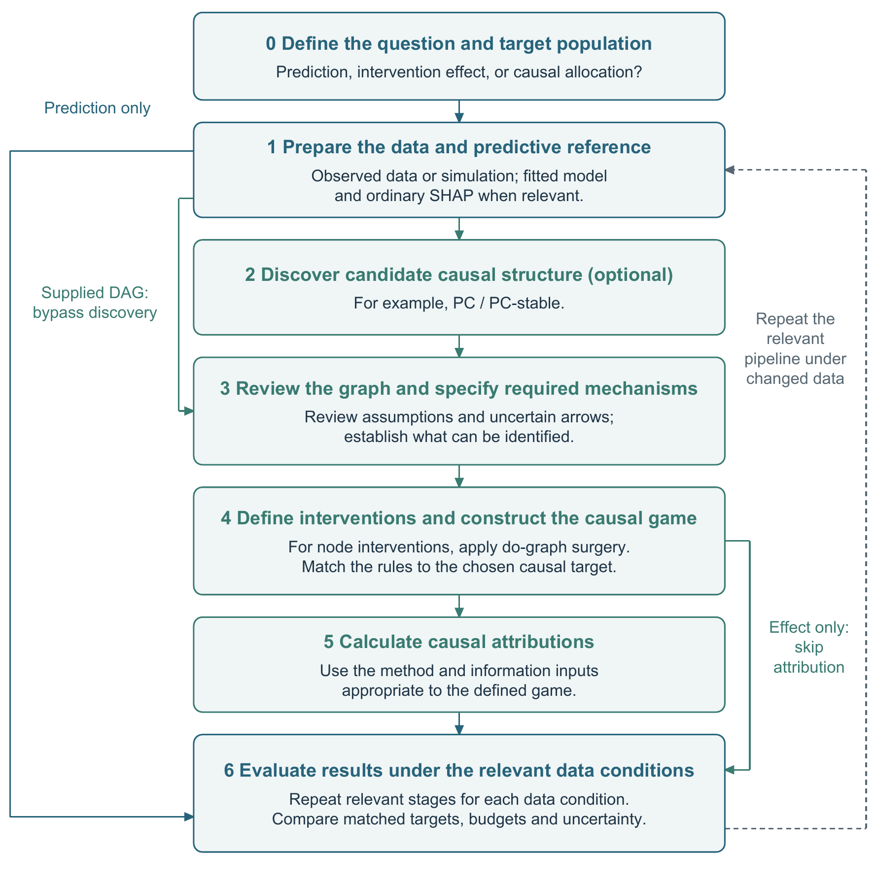

# Analytical workflow and method choices

The [Supplementary Information](supplementary-information/main.pdf) and manuscript
share Steps 0–6. Refine the [LaTeX source](supplementary-information/main.tex),
[BibTeX](supplementary-information/references.bib) and
[editable schematics](supplementary-information/diagrams/README.md), using the
[build instructions](supplementary-information/README.md).

The [evidence map](central-workflow.md) records results and remaining work;
[method choices](method-choices.md) discusses alternatives. Study procedures
remain in the main manuscript; the supplement explains analytical choices
and interpretation.

| Step | Operation |
| --- | --- |
| 0. Define the question and target population | Prediction, an intervention contrast or allocation; specify population and timing. |
| 1. Prepare the data and predictive reference | Declared data or simulation, fitted predictor and ordinary SHAP comparator. |
| 2. Discover candidate causal structure (optional) | PC or a justified alternative; a supplied graph bypasses discovery. |
| 3. Review the graph and specify required mechanisms | Document evidence and revisions; retain uncertainty and identify required mechanisms. |
| 4. Define interventions and construct the causal game | State the target, intervention values, background and scale; do-surgery where applicable. |
| 5. Calculate causal attributions | Apply the selected allocation rule and state the causal information supplied. |
| 6. Evaluate results under the relevant data conditions | Assess the declared targets; rerun relevant steps when data conditions change. |

A supplied DAG enters graph review directly. The prediction route reaches
predictive evaluation after Step 1; an effect-only question can omit Step 5.
Graph review assesses the observational model; do-surgery represents a
specified intervention within it.

The detector and filter are optional, unevaluated extensions. Longitudinal
analysis and recourse also remain outside the completed comparisons. The
[selection note](../technical/selection-mechanism.md) provides an illustrative
overlay and an exact calculation separate from either renal simulation.

For implementation, the [legacy work-package crosswalk](protocol.md) preserves
script IDs and result paths. Those IDs no longer number the manuscript's
Methods. [Graph sourcing](dag-harvest-protocol.md) and the earlier
[structural-recovery schematic](../images/fig1_space_shap_spine.png) remain
available as supporting documentation.
