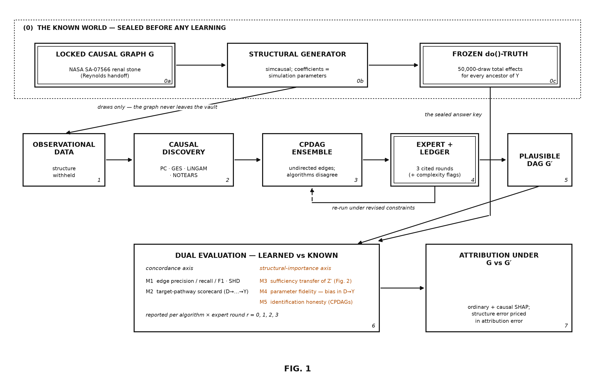
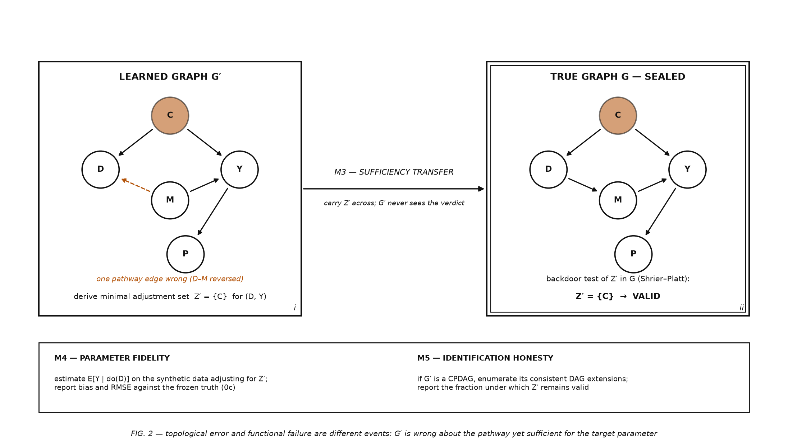

# Framework and protocol mappings

The [central workflow](central-workflow.md) connects the study's seven
stages to the examples and renal simulations. The [13-step protocol](protocol.md)
lists implementations and status. The framework below describes proposed
analytical roles; it has not been validated end to end. Rungs three and four
remain unevaluated placeholders.

The prediction playbook is rungs 0 to 2 and stops there. The intervention
playbook continues.

| Rung | Question | Inputs | Tools here | Guards against |
| --- | --- | --- | --- | --- |
| 0. Harvest the graph | What do we already believe about the mechanism? | Literature, expert DAGs (NASA HSRB), evidence levels | [DAG harvest protocol](dag-harvest-protocol.md) (CSER rubric); `analysis/10_ingest_robert_dags.R`; `config/dag_spec.yaml` with per-edge evidence status | Drawing the graph at the wrong granularity; unrecorded provenance |
| 1. Predict | What is likely to happen? | Data (here: simulated from the graph with an answer key) | `pipeline/step03_simulate_data.R`; `analysis/generate.R`; engines in `config/model_engines.yaml` | Treating predictive accuracy as evidence about mechanism |
| 2. Explain | What did the model use? | A fitted model | `pipeline/step04_baseline_shap.py` (five explainer and model pairings) | Reading the ranking as a list of levers; mediators absorbing their parents' credit |
| 3. Cast wider | Which discarded nodes deserve a second look? | The fitted model's internal geometry | LumaWarp detector: contract in `python/src/causal_shap_renal/lumawarp_contract.py`; drivers `pipeline/step05_*`, `step07_*` | Deep nodes washed out by depth and variance ([figure](../images/depth_washout.png)) |
| 4. Filter | Signal, or a column of noise? | Two detector channels at different sensitivities | Dichromatic sensitivity gating (Lexi Pasi; design in [`../lumawarp/README.md`](../lumawarp/README.md) section 5) | A single threshold that must choose between missed deep nodes and admitted noise |
| 5. Prune and propagate | What moves under do()? | The graph, expert review, a structural model | `pipeline/step06*` (ASV, Shapley Flow, Ng et al.); `apps/causal_shap/structural_value.py` (intervention propagation); `apps/causal_shap/discovery.py` and `evaluation.py` (M1-M5) for the discovery route | Ordering-only methods that are tied with ordinary SHAP; discovered graphs that never reach the outcome |
| 6. Price | Which affordable action is worth testing? | Manipulable ancestors, a cost sheet, a budget | `apps/causal_shap/policy.py`, `action_costs.py`, `shift_estimation.py` | Reading a Shapley value as an achievable effect; the degenerate benefit-per-cost ratio |

## What each rung must report

Each result should state
its estimand and intervention semantics, graph and data regime, evidence
status (teaching, matched comparison, prototype), computational budget, and
uncertainty procedure. For this playbook add two items per rung:

- **Depth accounting.** Report each candidate node's directed distance to
  the outcome and the rung's sensitivity at that depth. The proximity-bias
  metrics (PBI, POA, proximal mass) in
  [`../full_dag/proximity-bias-metrics.md`](../full_dag/proximity-bias-metrics.md)
  are the summary statistics.
- **Assumption ledger.** Name the working assumptions and their limits.
  Selected continuous mechanisms use affine approximations, while the
  binary-logit outcome and interaction require different treatment. A direct
  arrow does not guarantee linearity. Nonlinear robustness in Step 9 is
  pending, not a completed assessment of this assumption.

## Protocol crosswalk

The table maps the workflow to the authors' protocol and earlier schematics.
These are planning frameworks, not separate completed analyses.

| Workflow stage | Rungs | Aimee Harrison's 13-step protocol (methods draft, 2026-08-10) | Andy Wilson's schematic (FIG. 1, 2026-08-09) | ACIC 2026 workflow (Harrison et al.) | Scope list (Box `PLAN.md`, July 2026) |
| --- | --- | --- | --- | --- | --- |
| 01 Data | 0, 1 (inputs) | 1 exposure and outcome; 2 DAG review and augmentation; 3 simcausal data | 1 Data | (data in hand) | 1 living DAG; 2 anchors; 3 synthetic data |
| 02 Predict and explain | 1, 2 | 4 out-of-box SHAP | 2 predictive model; 3 ordinary SHAP; 4 importance ranking, marked "targets?" | (the baseline it corrects) | 4 ordinary SHAP side of the comparison |
| 03 Discover | 5 (discovery route) | 8 DAG recovery: PC, GES, LiNGAM, NOTEARS | 5 causal discovery ("they disagree"); 6 DAG hypothesis (CPDAG) | 1 Discover | |
| 04 Cast wider, then filter | 3, 4 | 5 LumaWarp pass on step 4; 7 LumaWarp reassessment of step 6 | 7 complexity detector, flags "look upstream" into the expert | (future direction: sensing causal depth) | 5 Luma Warp layer |
| 05 Resolve the graph | 5 (expert review) | 6 (the expert-in-the-loop rounds inside the Causal SHAP comparison) | 8 human expert: reviews, constrains, revises the DAG | 2 Resolve | |
| 06 Propagate | 5 (structural propagation) | 6 Causal SHAP, four methods | 9 structural Causal SHAP, credit propagated by do() | 3 Weight; 4 Compute | 4 Causal SHAP side of the comparison |
| 07 Price | 6 | 13 cost-aware manifold warping for cost-sensitive DiCE | 11 intervention targets ("levers, not ears") | | 6 intervenability and cost ranking; 7 cost-sensitive DiCE |
| Across all steps | robustness | 9 other simulators; 10 space-epi constraints; 11 out-of-distribution; 12 longitudinal | 10 simulation validation, "rehearse where the answer is known" | 5 Sensitivity | |

Two things the consolidation settles and one it leaves open.

- **The detector sits before the expert.** The 2026-08-09 schematic routes
  the detector's flags into the human expert ("h0-loud and SHAP-quiet, look
  upstream"), and the 13-step protocol runs the LumaWarp pass on the
  ordinary-SHAP output before the Causal SHAP comparison. The site follows
  that order. The 13-step protocol's second pass (step 7, after Causal SHAP)
  is the audit reading, and the site notes it as the alternative.
- **Robustness is a band, not a step.** Steps 9 to 12 of the protocol, the
  schematic's simulation-validation loop, and the ACIC workflow's
  sensitivity step all run across the path rather than at one point on it.
  The site says so in one sentence rather than adding an eighth step.
- **Open: which two channels the filter pairs.** Question 3 in the framing
  memo. The consolidation does not decide it.

## How the article's 13 steps map onto the rungs

| Rung | Methods-doc steps |
| --- | --- |
| 0 | 2 (DAG construction and expert-guided augmentation) |
| 1 | 1, 3 |
| 2 | 4 |
| 3 | 5, 7 |
| 4 | 5, 7 (the gating rule) |
| 5 | 6, 8 |
| 6 | 13 (out of the article's scope) |
| Robustness across all rungs | 9, 10, 11 |

## How the consolidated plan's phases map onto the rungs

The original plan groups the proposed analyses into these phases.

| Phase | What | Rungs |
| --- | --- | --- |
| 0. The known world | Locked graph, generator, frozen do()-truth | 0, 1 |
| I. Unknown structure to CPDAGs | PC, GES, DirectLiNGAM, NOTEARS run blind; disagreement reported as a finding | 5 (discovery route) |
| II. CPDAGs to plausible DAGs | Versioned constraint ledger and expert rounds | 5 |
| III. Learned versus known, two axes | Concordance (M1, M2) and structural importance (M3 sufficiency transfer, M4 parameter fidelity, M5 identification honesty); `apps/causal_shap/evaluation.py` | 5 |
| IV. Attribution under the graphs | Ordinary SHAP against the causal variants, under the known and the plausible DAGs | 2, 5 |
| V. The complexity companion | Detector flags alongside attribution; M6 asks whether flags coincide with true adjustment-set members or pathway ancestors more than chance | 3, 4 |
| VI. Robustness | Steps 9 to 11 | all |

## Rung 5 in two figures: learned versus known

Both are the manuscript's schematics (`analysis/make_spine_figs.py`).
Figure 1 is the spine: the known world is sealed before any learning, the
data go through discovery, an expert ledger, and a plausible graph, and the
learned graph is judged on two axes before attribution is computed under
both graphs. Figure 2 is the point of the second axis: topological error and
functional failure are different events. A learned graph can have a
pathway edge reversed and still yield a valid adjustment set for the target
parameter, and only sufficiency transfer (M3), parameter fidelity (M4), and
identification honesty (M5) can tell.

## The July 2026 schematic

The first whiteboard version of the pipeline, before the depth reframing.
It already had the pieces the playbook keeps: a sealed DAG, synthetic data
with "no peeking", one fitted model, simulated counterfactuals, an expert
cost ranking, and a policy step at the end.

## To write

- One worked example per rung on the 14-node working subgraph, in the order
  above, with the same figure grammar as the site.
- The gating rule for rung 4 (owner: Lexi Pasi).
- The E1 to E3 experiments as the test of rungs 3 and 4.
