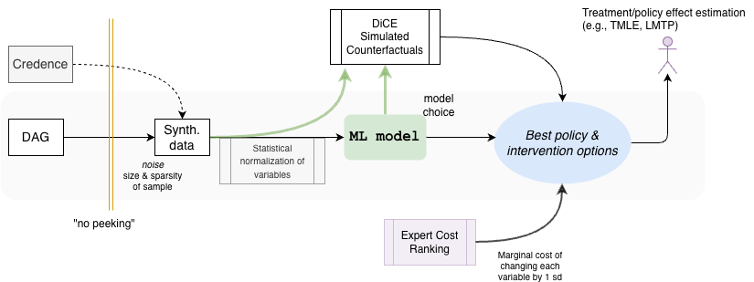

# The playbook: graph-based intervention estimation, step by step

**Status:** skeleton, 2026-09-04. This is the written guide the *npj
Microgravity* article and the companion site condense. Each rung names the
question it answers, the inputs it needs, the tools that exist in this
repository, and the failure it guards against. Rungs three and four are
placeholders (ADR 008). The argument behind the ordering is in the
[framing memo](../framing/prediction-vs-intervention.md).

The prediction playbook is rungs 0 to 2 and stops there. The intervention
playbook continues.

| Rung | Question | Inputs | Tools here | Guards against |
| --- | --- | --- | --- | --- |
| 0. Harvest the graph | What do we already believe about the mechanism? | Literature, expert DAGs (NASA HSRB), evidence levels | [DAG harvest protocol](dag-harvest-protocol.md) (CSER rubric); `analysis/10_ingest_robert_dags.R`; `config/dag_spec.yaml` with per-edge evidence status | Drawing the graph at the wrong granularity; unrecorded provenance |
| 1. Predict | What is likely to happen? | Data (here: simulated from the graph with an answer key) | `pipeline/step03_simulate_data.R`; `analysis/generate.R`; engines in `config/model_engines.yaml` | Treating predictive accuracy as evidence about mechanism |
| 2. Explain | What did the model use? | A fitted model | `pipeline/step04_baseline_shap.py` (five explainer and model pairings) | Reading the ranking as a list of levers; mediators absorbing their parents' credit |
| 3. Cast wider | Which discarded nodes deserve a second look? | The fitted model's internal geometry | LumaWarp detector: contract in `python/src/causal_shap_renal/lumawarp_contract.py`; drivers `pipeline/step05_*`, `step07_*` | Deep nodes washed out by depth and variance ([figure](../images/depth_washout.png)) |
| 4. Filter | Signal, or a column of noise? | Two detector channels at different sensitivities | Dichromatic sensitivity gating (Lexi Pasi; design in [`../lumawarp/README.md`](../lumawarp/README.md) section 5) | A single threshold that must choose between missed deep nodes and admitted noise |
| 5. Prune and propagate | What moves under do()? | The graph, expert review, a structural model | `pipeline/step06*` (ASV, Shapley Flow, Ng et al.); `apps/causal_shap/structural_value.py` (intervention propagation); `apps/causal_shap/discovery.py` and `evaluation.py` (M1-M5) for the discovery route | Ordering-only methods that are tied with ordinary SHAP; discovered graphs that never reach the outcome |
| 6. Price | Which affordable action is worth testing? | Manipulable ancestors, a cost sheet, a budget | `apps/causal_shap/policy.py`, `action_costs.py`, `shift_estimation.py` | Reading a Shapley value as an achievable effect; the degenerate benefit-per-cost ratio |

## What each rung must report

Carried over from the Target DAGs record: every substantive result states
its estimand and intervention semantics, graph and data regime, evidence
status (teaching, matched comparison, prototype), computational budget, and
uncertainty procedure. For this playbook add two items per rung:

- **Depth accounting.** Report each candidate node's directed distance to
  the outcome and the rung's sensitivity at that depth. The proximity-bias
  metrics (PBI, POA, proximal mass) in
  [`../full_dag/proximity-bias-metrics.md`](../full_dag/proximity-bias-metrics.md)
  are the summary statistics.
- **Assumption ledger.** Name the working assumptions the rung leans on and
  how strongly they are enforced. The one that runs through the whole
  playbook is that direct relationships tend to be linear: enforced in the
  generating model, relaxed in the estimators, priced in Step 9.

## How the article's 13 steps map onto the rungs

| Rung | Methods-doc steps |
| --- | --- |
| 0 | 2 (DAG construction and expert-guided augmentation) |
| 1 | 1, 3 |
| 2 | 4 |
| 3 | 5, 7 |
| 4 | 5, 7 (the gating rule) |
| 5 | 6, 8 |
| 6 | 13 (out of the article's scope) |
| Robustness across all rungs | 9, 10, 11 |

## How the consolidated plan's phases map onto the rungs

The 2026-08-10 consolidated plan (private, `docs/manuscript/`) walks the
same road as a spine of phases. Rung numbers are from the table above.

| Phase | What | Rungs |
| --- | --- | --- |
| 0. The known world | Locked graph, generator, frozen do()-truth | 0, 1 |
| I. Unknown structure to CPDAGs | PC, GES, DirectLiNGAM, NOTEARS run blind; disagreement reported as a finding | 5 (discovery route) |
| II. CPDAGs to plausible DAGs | Versioned constraint ledger and expert rounds | 5 |
| III. Learned versus known, two axes | Concordance (M1, M2) and structural importance (M3 sufficiency transfer, M4 parameter fidelity, M5 identification honesty); `apps/causal_shap/evaluation.py` | 5 |
| IV. Attribution under the graphs | Ordinary SHAP against the causal variants, under the known and the plausible DAGs | 2, 5 |
| V. The complexity companion | Detector flags alongside attribution; M6 asks whether flags coincide with true adjustment-set members or pathway ancestors more than chance | 3, 4 |
| VI. Robustness | Steps 9 to 11 | all |

## The July 2026 schematic

The first whiteboard version of the pipeline, before the depth reframing.
It already had the pieces the playbook keeps: a sealed DAG, synthetic data
with "no peeking", one fitted model, simulated counterfactuals, an expert
cost ranking, and a policy step at the end.

## To write

- One worked example per rung on the 14-node working subgraph, in the order
  above, with the same figure grammar as the site.
- The gating rule for rung 4 (owner: Lexi Pasi).
- The E1 to E3 experiments as the test of rungs 3 and 4.
