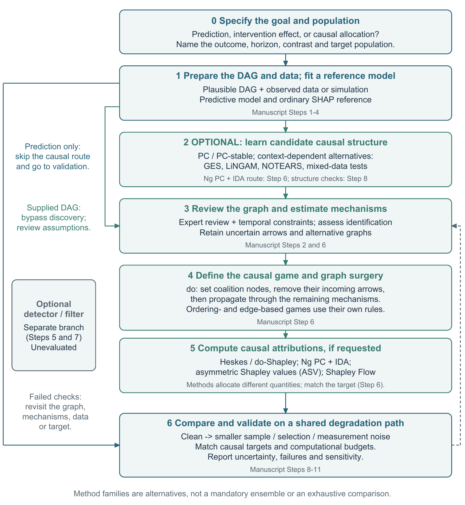

# The causal-SHAP workflow and its evidence

The playbook follows the manuscript's method sequence. The goal gate routes a
prediction question to the predictive reference and validation, while the causal
route makes discovery, graph review, intervention construction and allocation
explicit. These are seven stages numbered 0–6, grouping the original protocol.

The [editable LaTeX article](study-guide-latex/README.md) and its
[PDF](study-guide-latex/main.pdf) develop the steps; the
[method appendix](method-choices.md) compares alternatives within them.

| Stage | Method operation | Manuscript protocol |
| --- | --- | --- |
| 0. Define the target | Prediction, an individual intervention effect or allocation of a joint contrast; population and timing. | Step 1 and target definitions |
| 1. Prepare data and the predictive reference | Supplied DAG, specified simulation mechanisms, synthetic data, fitted model and ordinary SHAP. | Steps 2–4 |
| 2. Discover candidate structures (optional) | PC is the existing starting point; consider PC-stable, appropriate mixed-data tests, GES, LiNGAM or NOTEARS. A supplied DAG bypasses discovery. | Discovery within Step 6; broader Step 8 comparison |
| 3. Review the graph and estimate mechanisms | Review timing, evidence and uncertain edges; record revisions; estimate mechanisms where the selected method requires them. | Step 2 and review within Step 6 |
| 4. Define the causal game and graph surgery | Specify coalition, background, scale and intervention; a do-game replaces assignment mechanisms and removes incoming arrows to intervened nodes. | Value-function component of Step 6 |
| 5. Calculate causal attributions | Causal Shapley/do-Shapley, Ng et al., ASV and Shapley Flow use distinct allocation rules and information. | Attribution component of Step 6 |
| 6. Compare under data degradation | Assess prediction, structure, attribution and individual-effect ranking separately; repeat selected comparisons under smaller samples, selection and measurement changes. | Evaluation in Steps 4/6/8; proposed robustness in 9–11 |

Expert graph revision changes the hypothesized observational structure.
Do-surgery represents a specified intervention on that structure. Ordering-only
or edge-allocation methods must not silently be presented as the same
interventional game. An effect-only question can omit Shapley allocation.

The optional detector/filter sits beside the comparisons (Steps 5 and 7) and
can feed future graph review; it remains unevaluated. Longitudinal analysis
(Step 12) and action/recourse evaluation (Step 13) are extensions, not completed
endpoints. The systematic degradation comparison is proposed, not a new result.

The existing PC diagnostic comes from protocol Step 6; Step 8 is the broader
working-subgraph comparison that remains pending. The full-DAG ordering and
propagation analyses are separate pipelines feeding stages 5 and 6. The
crosswalk groups analytical operations rather than renumbering experiments.

The Step 2 augmentation uses Robert Reynolds's supplied graph files. No
human reviewed the Step 6 rounds. Round 1 uses the unrevised inputs:
depth-tier ordering for ASV, PC output for Ng et al., and no inter-feature
edges for Shapley Flow. After the scripted heuristic in rounds two and three,
XGBoost rank agreement changes from 0.231 to 0.205 for ASV, from 0.077 to
0.154 for Shapley Flow, and from undefined (all-zero attribution) to 0.714
for Ng et al. These are different revision rules and method budgets, not a
controlled test of expert review. See the complete [Step 6 record](../step06_results.md).

The matched full-DAG ordering comparison uses 64 evaluation records, 128
background records and 128 permutations for each method. The propagation
prototype uses 32 evaluation records, 32 background records and 32
permutations, as well as additional mechanism information. Its budget is
not matched to the ordering comparison.

## Attribution accuracy and intervention-ranking agreement

The renal benchmark compares mean-absolute attribution rankings with individual
high-versus-low intervention effects. A do-Shapley value allocates a joint
intervention contrast and need not equal an individual effect. These scores
therefore assess agreement with a screening target, rather than isolate
estimation error for each method's own attribution game. The
[Jung/Heskes tutorial](../technical/do-shapley.md) gives the definitions and
an exact two-player oracle. A corresponding renal oracle comparison remains
pending.

## What the worked examples establish

The four-node illustration is **X → A → M → Y**. Under full mediation,
independent disturbances and exact measurement of M, Y is conditionally
independent of X and A given M. An ideal predictor using M alone need not
use X or A. Model-interventional SHAP gives unused inputs zero attribution;
conditional SHAP can behave differently. Nevertheless, changing X can change
Y through the intervening nodes. In an affine chain with coefficients a, b
and c, the mean response slope for an intervention on X is abc.

The animation's bar heights are schematic. They illustrate a change in what
is being credited, not measured SHAP values, effect sizes, or comparable
totals across the two phases. They do not show that X is the best action.

The [classroom lab](../classroom/README.md) collapses A into the X-to-M
relationship, giving an exactly specified two-player example. At its default
settings, M = 0.6X + eM, Y = 0.6M + eY, x = 1 and eM = 0.2, with independent
mean-zero disturbances. The predictor f = 0.6M gives 0.48. Predictive
model-interventional Shapley credit is (0, 0.48). A specified symmetric
structural game gives (0.18, 0.30), whereas setting X from 0 to 1 changes the
population mean Y by 0.36. Attribution and intervention contrast answer
different questions. This toy does not reproduce the asymmetric full-DAG
prototype numerically or run discovery, expert review, the detector or action
selection. The [educator guide](../classroom/educator-guide.md) gives the game
definitions and derivation.

## How the simulations extend the example

The **14-node working subgraph** adds multiple pathways, a binary outcome,
an interaction and competing predictors. It tests whether attributions agree
with fixed simulated intervention contrasts. The [Step 4 record](../step04_results.md)
shows credit shifting in both directions across chains and model classes;
it does not establish universal upstream suppression. The [Step 6 record](../step06_results.md)
retains the disconnected-outcome diagnostic and scripted revisions.

The **51-node full-DAG simulation** carries a separate matched comparison:
ordinary SHAP versus ordering-only attribution has Kendall's tau 0.506 versus
0.528, with a paired-bootstrap interval for their difference that includes
zero. This is no detected difference, not equivalence. The 32×32×32 structural
propagation prototype has tau 0.794 and top-five recovery 1.00, without
repeated-seed uncertainty. See the [full research record](../full_dag/RESEARCH_RECORD.md).
Scores across these testbeds are not a single head-to-head benchmark.

### What information each comparison receives

The working subgraph is a scoped, augmented representation of the renal
system, including additional mediators and an interaction. It is not simply
14 unchanged nodes cut from the 51-node simulator. Its coefficients are
specified separately in `config/edge_coefficients.yaml`; the full DAG uses
`analysis/R/renal_stone_source_aligned_simcausal.R`. The two generators and
intervention ranges are not interchangeable.

| Comparison | Data and causal information supplied |
| --- | --- |
| Working-subgraph baselines | n = 1,000, seed 20260812. Predictors are fitted to simulated data; the true graph and coefficients define the evaluation truth, not the ordinary SHAP coalition game. |
| Working-subgraph scripted rounds | Same seeded dataset. Ng et al.'s Causal SHAP starts from PC's discovered graph. The script orients unresolved edges using the known graph and reconnects an isolated outcome using the strongest marginal absolute correlation. The other methods' revision rules consult the known graph or prior attribution errors against truth. These are truth-informed diagnostics, not blinded human validation. |
| Full-DAG matched ordering comparison | Clean-v3 n = 10,000, generation seed 20260710. Both methods explain the same fitted XGBoost predictor with the same background, evaluation records and permutation budget. The ordering variant is supplied the true graph's ordering constraints. |
| Full-DAG propagation prototype | The same fitted XGBoost model is scored after interventions are propagated using the supplied graph and known simulation mechanisms, reconstructed in `apps/causal_shap/nasa_scm.py`. This is an oracle-mechanism feasibility comparison, not recovery of unknown mechanisms from observational data. Its evaluation/background/permutation budget is 32×32×32. |

Both renal outcomes are binary. The ranking target is the absolute difference
in simulated nephrolithiasis probability between specified high and low
settings, estimated using 50,000 common-random-number draws. In the working
subgraph, standardized continuous variables use -1 versus +1; raw-unit roots
use their mean minus versus plus one SD; binary variables use 0 versus 1.
The full DAG uses clean-v3 Q25 versus Q75 for continuous variables and 0
versus 1 for binary variables. These are contrasts, not a common one-unit
causal slope. SHAP output scales also differ across some model pairings;
rank agreement does not make their raw magnitudes comparable.

Sources: [working truth implementation](../../r/R/ground_truth.R),
[full-DAG truth implementation](../../analysis/06_compute_interventional_truth.R),
[matched comparison](../../analysis/07_run_shap_comparison.R),
[mechanism reconstruction](../../apps/causal_shap/nasa_scm.py), and the
[scripted revision rules](../step06_results.md).

The five-node teaching stress test in that record is a third testbed. Its
45.6% attribution to an outcome descendant is deliberately pedagogic; it is
neither the classroom chain nor a renal result.

## Assumptions and unfinished checks

A direct arrow specifies a structural dependency, not its response shape.
Selected continuous mechanisms use affine approximations; the binary-logit
outcome and interaction mean the entire generator is not linear-Gaussian.
Nonlinear robustness is pending. The depth figure is a separate marginal-slope
power experiment on a single standardized chain, not a causal-discovery
accuracy study. Effects attenuate there because each edge coefficient is
0.6; general paths can reinforce or cancel. There is no universal guarantee
that longer paths have smaller effects or that linearity identifies direction.

The current evidence supports a benchmark and diagnostic workflow. It does
not supply empirically calibrated astronaut effects, validated detector
results, actual human expert-loop results, or recommended actions.
