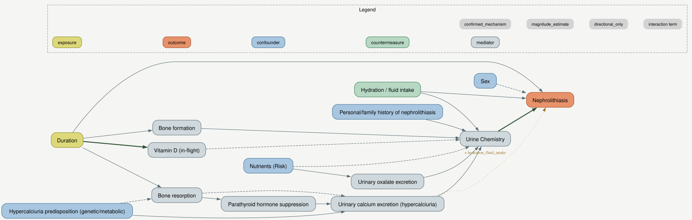

# Step 4 results — baseline attribution with standard SHAP

`data/frozen_truth/ground_truth_total_effects.parquet` (R, interventional) and
`results/attributions/step04_baseline_shap.parquet` (Python, five explainer/model
pairings) from this run. See `docs/step03_simulation_review.md` for the underlying
simulated data. Every number below is computed directly from these two files, not
asserted.

**Run:** n = 1,000 · seed = 20260812 · 14-node DAG · generated 2026-08-14.

This is a rerun of the original Step 4 baseline (11 nodes, 10 features) after adding
three realistic mediators/confounders that deepen two pathways by one hop each, to see
how credit distribution changes as mediation chains get longer. Where a finding differs
from the original 10-feature run, that comparison is called out explicitly below.

## The DAG



Three new nodes since the original run: `parathyroid_suppression` (splits
`bone_resorption -> urinary_calcium_excretion` into a direct mechanism plus a
PTH-mediated one), `urinary_oxalate_excretion` (splits `nutrients_risk -> urine_chemistry`
into a residual calcium/magnesium mechanism plus an oxalate-specific one), and
`hypercalciuria_predisposition` (a new confounder feeding both `bone_resorption` and
`urinary_calcium_excretion` directly - distinct from `history_of_nephrolithiasis`,
which is personal/family stone *history* rather than the underlying calcium-handling
phenotype). Edge style follows `config/dag_spec.yaml`'s evidence status: thick dark
green = `confirmed_mechanism`, solid = `magnitude_estimate`, dashed = `directional_only`,
dotted amber = the `urinary_calcium_excretion` x `hydration_fluid_intake` interaction.

## Ground truth vs. attributions

`ground_truth` is each feature's interventional standardized total effect on
P(nephrolithiasis = 1) (`do(feature = hi)` vs. `do(feature = lo)`, common random
numbers, n = 50,000). The other five columns are each explainer/model pairing's global
feature importance (mean |SHAP value| across the held-out test set). Rows sorted by
ground truth, descending.

| feature | ground truth | kernel_shap<br>xgboost | linear_shap<br>logistic_regression | permutation_shap<br>xgboost | tree_shap<br>random_forest | tree_shap<br>xgboost |
|---|---:|---:|---:|---:|---:|---:|
| `urine_chemistry` | 0.0964 | 0.9191 | 0.8613 | 0.9903 | 0.0226 | 0.7474 |
| `hydration_fluid_intake` | 0.0789 | 0.5005 | 0.0357 | 0.4314 | 0.0164 | 0.3772 |
| `duration` | 0.0611 | 0.7102 | 0.2285 | 0.6410 | 0.0145 | 0.6040 |
| `history_of_nephrolithiasis` | 0.0536 | 0.1933 | 0.3497 | 0.2604 | 0.0014 | 0.2458 |
| `urinary_oxalate_excretion` | 0.0467 | 0.3145 | 0.1447 | 0.1886 | 0.0121 | 0.1654 |
| `urinary_calcium_excretion` | 0.0429 | 0.5040 | 0.0379 | 0.5664 | 0.0186 | 0.5230 |
| `nutrients_risk` | 0.0365 | 0.5832 | 0.1993 | 0.4728 | 0.0094 | 0.4324 |
| `vitamin_d_inflight` | 0.0321 | 0.4259 | 0.2074 | 0.3949 | 0.0078 | 0.3424 |
| `hypercalciuria_predisposition` | 0.0224 | 0.3365 | 0.0866 | 0.3869 | 0.0124 | 0.3510 |
| `bone_resorption` | 0.0218 | 0.3685 | 0.0059 | 0.3754 | 0.0088 | 0.3231 |
| `parathyroid_suppression` | 0.0146 | 0.5298 | 0.2623 | 0.4339 | 0.0111 | 0.4069 |
| `sex` | 0.0129 | 0.1413 | 0.0855 | 0.1787 | 0.0058 | 0.1969 |
| `bone_formation` | 0.0045 | 0.5244 | 0.1018 | 0.4472 | 0.0123 | 0.4001 |

**Scale note (unchanged from the original run):** `tree_shap`+`random_forest` is on the
probability (0–1) scale; the other four are on the log-odds scale. Compare within a
column or by rank, not raw magnitude across the `random_forest` column and the rest.

## Interpretation

### 1. Rank agreement dropped everywhere, and the ranking of methods reshuffled

| Method | Engine | τ (10-feature run) | τ (14-feature run) |
|---|---|---:|---:|
| `tree_shap` | random_forest | 0.689 | **0.359** |
| `permutation_shap` | xgboost (black box) | 0.556 | 0.308 |
| `tree_shap` | xgboost | 0.422 | 0.282 |
| `linear_shap` | logistic_regression | **0.733** | 0.231 |
| `kernel_shap` | xgboost (black box) | 0.467 | 0.205 |

Every pairing's rank agreement with ground truth fell once the DAG gained real
mediation depth - unsurprising on its own, there are more ways to get 13 items' relative
order wrong than 10. What's notable is the *reordering*: `linear_shap` was the clear
leader in the shallow DAG (τ=0.733, closest to the true linear/log-linear generating
process) and is now second-to-last (τ=0.231), while `tree_shap`+`random_forest` - the
weakest-magnitude pairing throughout, still on the wrong scale to compare directly by
value - now leads on rank agreement. Adding real correlated mediator structure
(`urinary_calcium_excretion` now has three correlated parents:
`bone_resorption`, `parathyroid_suppression`, `hypercalciuria_predisposition`) hurts a
linear model's coefficient-based attribution more than it hurts a tree ensemble's
partition-based one - multicollinearity is a linear-regression problem first.

### 2. Two deeper chains, one clean failure and one near-perfect recovery

Ratio of the mediator's (proximal) attribution to its own parent's (distal)
attribution, within each newly-deepened chain:

**Chain A: `bone_resorption` → `parathyroid_suppression` → `urinary_calcium_excretion`**
(ratio = `urinary_calcium_excretion` / `bone_resorption`)

| | ratio |
|---|---:|
| **ground truth** | **1.97** |
| `tree_shap` (random_forest) | 2.12 |
| `tree_shap` (xgboost) | 1.62 |
| `permutation_shap` (xgboost) | 1.51 |
| `kernel_shap` (xgboost) | 1.37 |
| `linear_shap` (logistic_regression) | 6.39 |

**Chain B: `nutrients_risk` → `urinary_oxalate_excretion` → `urine_chemistry`**
(ratio = `urinary_oxalate_excretion` / `nutrients_risk`)

| | ratio |
|---|---:|
| **ground truth** | **1.28** |
| `tree_shap` (random_forest) | **1.28** |
| `linear_shap` (logistic_regression) | 0.73 |
| `kernel_shap` (xgboost) | 0.54 |
| `permutation_shap` (xgboost) | 0.40 |
| `tree_shap` (xgboost) | 0.38 |

Chain B is the cleanest failure in this whole report: in the true generating process,
the mediator `urinary_oxalate_excretion` is *slightly more* important than its own
parent `nutrients_risk` (ratio 1.28 - it sits one hop closer to the outcome). **Four of
five pairings invert this** - `nutrients_risk` outweighs its own mediator by
1.3x-2.6x (1/0.38 to 1/0.73) - misattributing the mediated effect back onto the distal
node, the textbook failure mode the methods doc describes, caught directly. Only
`tree_shap`+`random_forest` gets it right, and matches the true ratio almost exactly
(1.28 vs. 1.28).

Chain A shows the opposite kind of miss: every pairing gets the *direction* right
(mediator more important than parent), but `linear_shap` overshoots by more than 3x
(6.39 vs. 1.97) - it assigns `bone_resorption` almost no independent credit (0.0059,
the single smallest value anywhere in the attribution table) once `parathyroid_suppression`
and `hypercalciuria_predisposition` are both in the model, since a logistic regression's
coefficients divide credit among correlated predictors more sharply than a tree
ensemble's do.

### 3. The new confounder is recovered reasonably by every pairing

`hypercalciuria_predisposition` reaches the outcome through two separate paths
(`-> bone_resorption -> ...` and `-> urinary_calcium_excretion` directly) - a real test
of whether fan-out confounding gets diluted across the two paths or double-counted.
Ground truth ranks it 9th of 13 by importance; every pairing places it within two
ranks of that:

| Method | Engine | Rank |
|---|---|---:|
| ground truth | — | 9 |
| `tree_shap` | random_forest | 5 |
| `tree_shap` | xgboost | 8 |
| `linear_shap` | logistic_regression | 9 |
| `permutation_shap` | xgboost | 9 |
| `kernel_shap` | xgboost | 10 |

No pairing badly mis-ranks the fan-out confounder - a real contrast with Chain B's
mediator inversion. Confounding with clean fan-out appears to be an easier case for
this baseline than a genuine 2-hop mediation chain is.

### Limitations

- **One simulated dataset, one seed** - as before, see `docs/step03_simulation_review.md`'s
  coefficient-recovery table for the sampling noise already visible at n = 1,000.
- **All coefficients are training-purposes estimates**, including the three new edges'
  magnitudes (the *directions* and relative sizes are literature-grounded; see each new
  node's `source` field in `config/dag_spec.yaml`).
- **No real stacked-ensemble black box this round** - see
  `docs/decisions/005-superlearner-deferred.md`, unchanged from the original run.
- **Global importance only** - mean |SHAP value| across the test set, not per-observation.
- **Chain B's tree_shap+random_forest match (1.28 vs. 1.28) is one run's coincidence
  worth treating skeptically**, not proof that random forests solve mediation
  attribution in general - it's the same pairing that also has the weakest raw
  attribution magnitudes throughout (probability-scale, most values <0.03), so its
  ratios are more sensitive to small-number noise than the other four pairings' are.

## Reproduce

```bash
make step02   # regenerate the DAG (14 nodes)
make step03   # regenerate the simulated data
make step04   # regenerate ground truth (R) + attributions (Python)
```

Both `data/frozen_truth/ground_truth_total_effects.parquet` and
`results/attributions/step04_baseline_shap.parquet`'s `attribution_value` column are
reproducible at the fixed seed (20260812).
