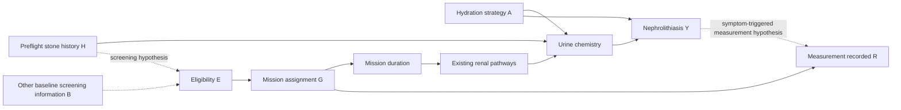

# Who enters the data, and who should the result describe?

Selection belongs beside the renal mechanism in the study diagram. A plausible account of stone formation does not explain why a person entered the astronaut corps, flew on a particular mission, or had a measurement recorded. Those processes determine what can be learned and where the result may apply.

This note proposes an **observation and selection overlay** for the existing 14-node working subgraph. It also supplies an exact, deliberately small selection example. It does not revise the source DAG or replace either renal simulation.

## Separate four decisions

| Layer | Indicator or definition | Timing and role |
|---|---|---|
| Source population | Candidates, eligible crew, or another explicitly named population | Define whose distribution generates baseline characteristics. Do not silently substitute the general population for astronaut candidates. |
| Eligibility / entry | `E`: enters the eligible or recruited cohort | Baseline health and prior history may affect entry. Record the date and which characteristics were available then. |
| Mission assignment | `G`: assigned to the mission under study | May depend on eligibility, fitness, expertise and mission requirements. Specify whether this occurs before the intervention of interest. |
| Observation | `R`: outcome or covariate is recorded at the relevant visit | Measurement can depend on health, symptoms, schedule and follow-up. Use separate indicators for distinct measurements where necessary. |
| Target population | The people and mission conditions the analysis is intended to describe | This is a scientific choice, not necessarily another selection event. Current crew, future crews and Earth analog volunteers are different targets. |

NASA requires applicants to pass its long-duration flight physical and uses staged selection. Its current urinary-health brief describes individual evaluation of stone risk before flight; a history of stones should **not** be encoded as universal automatic exclusion based on our older narrative wording. These sources motivate explicit screening and observation processes, but do not identify their coefficients. [NASA astronaut selection](https://www.nasa.gov/humans-in-space/astronauts/become-an-astronaut/); [NASA urinary-health technical brief](https://www.nasa.gov/ochmo-mtb-003-urinary-health-2/).

## Add an overlay without changing the biological edges

For a countermeasure introduced **after** mission assignment, let `H` denote the existing `history_of_nephrolithiasis` node, `A` a specified intervention on `hydration_fluid_intake`, and `Y` the existing `nephrolithiasis` outcome. Add baseline screening information `B`, eligibility `E`, assignment `G`, and observation `R`. A schematic subset is:



This figure shows only selected renal paths; the remainder of the 14-node graph is retained. Added screening and measurement arrows are hypotheses to review with domain experts, not NASA-confirmed edges. In a full design, separate recruitment from physiological eligibility if their causes differ. If `Y` is not available before measurement, the `Y -> R` arrow represents an underlying event or symptoms prompting ascertainment, not foreknowledge of a future stone. Preflight eligibility must depend on preflight information, not realized in-flight outcomes.

Selection may induce associations: conditioning on a common effect such as `H -> E <- B` can associate its causes, even when they were independent in the source population. Whether that opens a biasing path for a particular causal contrast depends on the rest of the graph. Selection alone is not proof of bias in every estimand. [Hernán, Hernández-Díaz and Robins (2004)](https://pubmed.ncbi.nlm.nih.gov/15308962/).

## State the target before correcting selection

For a baseline-selected crew and a subsequently assigned countermeasure, an appropriate question may be

\[
\Delta_{crew}=E[Y^{a_1}-Y^{a_0}\mid E=1,G=1].
\]

That quantity can differ from the effect in the source population because the distribution of effect modifiers differs. The difference is not automatically estimator bias. If the target is future crew, name their characteristics and mission regime instead of assuming today's selected sample represents them.

If assignment or selection occurs **after** the exposure under study, use its exposure-dependent counterpart, for example `G^a`, and revisit the question. Comparing `E[Y^a | G^a=1]` across exposures can compare different groups. A common-population effect or a principal-stratum effect requires an additional definition and identification assumptions. In particular, the baseline-crew equation above cannot simply be reused to study an earlier exposure that itself affects crew selection.

Transporting a contrast to a specified target can use standardization over baseline effect modifiers or appropriate selection weights, provided treatment identification, consistency, conditional transportability and overlap are defensible. The target covariate distribution must also be available. No reweighting recovers an entirely excluded stratum without additional information or extrapolation assumptions. [Dahabreh et al. (2019)](https://pmc.ncbi.nlm.nih.gov/articles/PMC10938232/).

Prediction has a parallel requirement: validate calibration and error in the intended deployment population and mission setting. An accurate predictor in the observed crew can fail elsewhere without any change to the biological arrows. Neither prediction nor causal effect estimation is exempt from selection and measurement problems.

## An exact exploratory example

Run from the repository root:

```bash
python analysis/selection_mechanism_demo.py --check
```

The example enumerates four baseline strata rather than fitting a model or generating random samples. It borrows the renal labels `H = history_of_nephrolithiasis`, `A = hydration strategy`, and `Y = nephrolithiasis`, and adds a hypothetical binary fitness variable `F`. It is a **reduced illustration, not the 14-node working simulation or the 51-node NASA-topology simulation**. No parameter, prevalence or dose is calibrated to astronauts.

In the hypothetical candidate population, `H ~ Bernoulli(0.2)` and `F ~ Bernoulli(0.5)` independently. Selection precedes `A`; intervention assignment is randomized within each selected population. The imposed response model is

\[
P(Y^a=1\mid H,F)=\operatorname{expit}\{-2+0.8H-0.3F-a(0.5+0.4H)\}.
\]

The protective effect of `F` and effect modification by `H` are assumptions for this example, not additions to the biological source graph. The soft-selection probability is `expit(0.2 + 1.2F - 1.4H)`. All four strata remain represented. A separate hard-exclusion stress test sets selection probability to zero for `H=1`; this tests support failure and is not a proposed description of current NASA policy.

| Selection regime | Retained | History prevalence | Correlation of H and F | Selected-population risk difference | Source effect recovered by weighting? |
|---|---:|---:|---:|---:|---|
| None | 100% | 20.00% | 0 | -5.302 percentage points | -5.302 points |
| Random half | 50% | 20.00% | 0 | -5.302 points | -5.302 points |
| Soft screening | 61.40% | 11.91% | 0.060 | -4.589 points | -5.302 points |
| Hard exclusion | 54.08% | 0% | Undefined: H is constant | -3.768 points | Not identified by weighting: 20% of source population lacks support |

These are exact expectations under the declared equations. Random thinning preserves the target quantities. Soft selection induces a small baseline association and changes the selected-population effect; with the true selection probabilities, inverse-probability weighting recovers the source contrast. Because `A` is randomized, the example does **not** demonstrate confounding of the treatment effect within the selected population. Its purpose is to distinguish changed population composition, collider associations and loss of transport support. It does not evaluate finite-sample estimator performance or unknown selection probabilities.

Results and assumptions are written to [the isolated exploration output](../../analysis/output/selection_exploration/metadata.json), alongside [the exact result table](../../analysis/output/selection_exploration/exact_results.csv). Checks cover the no-selection baseline, random-selection null, risk-difference identity, exact reweighting recovery and refusal to report a full-source weighted effect under hard exclusion.

## Relation to the existing experiments

The [14-node specification](../../config/dag_spec.yaml) already lists selection as metadata outside its biological node list. This note makes its intended role visible; it does not assert that the working pipeline already implements this overlay. The separate [full-DAG generator](../../analysis/R/renal_stone_source_aligned_simcausal.R) already adds fitness/age-based selection and informative measurement in its NASA-like v4 regime. That generator's selection and measurement assumptions should be reviewed separately; they are not results of the example above.

The next renal comparison should preserve a common candidate source and outcome mechanisms, then vary eligibility, assignment and observation one at a time. Report performance against each declared target, including a no-selection baseline, rather than treating every change as attribution error. A broader survey of selection-adjustment methods and the full combination of modeling choices are outside this focused demonstration.
