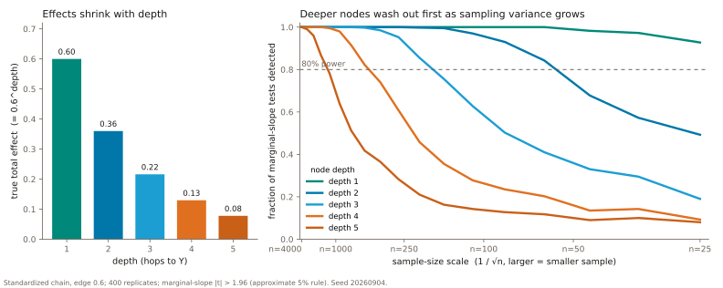

::: {.editorial-shell}
::: {.hero}
<p class="lineage-tag"><a href="https://www.tao-rwd.com/acic-2026/causal-shap">ACIC 2026 CAUSAL SHAP</a> <span>→</span> <a href="target-dags.html">TARGET DAGS</a> <span>→</span> SPACEFLIGHT RENAL STONES</p>

# Prediction is the default playbook. **Intervention casts a wider net.**

<p class="hero-lede">A predictor can ignore an upstream cause the moment its mediator is in view. An intervention cannot. This site is the companion to an article on graph-based intervention estimation for <em>npj Microgravity</em>: a playbook for <mark>finding the deeper nodes the prediction playbook washes out</mark>, and for pruning them without fooling ourselves.</p>

Two goals, two recipes. The recipe for prediction is well known and works. The recipe for intervention needs a detector for depth, a filter for noise, and a structural model for pruning. Everything here is synthetic, generated from NASA's renal-stone topology with an answer key we wrote, and scored against frozen total-effect truth.

<div class="hero-actions">
  <a class="button button-primary" href="#playbooks">See the two playbooks</a>
  <a class="button button-secondary" href="https://github.com/ahhatype/causal-shap-spaceflight-renal-stones/tree/main/docs">Open the research record ↗</a>
</div>
:::

<figure class="archive-illustration wizard-illustration">
  
  <figcaption><strong>The original ACIC motivation.</strong> A model can reward the closest measured feature while hiding the system that produced it. Illustration from the <a href="https://www.tao-rwd.com/acic-2026/causal-shap">archived project</a>.</figcaption>
</figure>

<div class="thesis-line" aria-label="From prediction to an intervention target">
  <span>predict</span><b>→</b><span>explain</span><b>→</b><span>cast wider</span><b>→</b><span>filter</span><b>→</b><span>prune and propagate</span><b>→</b><span>price</span>
</div>

## Two goals, two playbooks {#playbooks}

<p class="section-deck">Prediction and intervention are different goals with different recipes; the split is standard in statistics and epidemiology (Shmueli 2010; Hernán, Hsu and Healy 2019; Harrell 2015). Explainable AI runs the prediction recipe by default. That is fine for prediction and structurally wrong for intervention.</p>

::: {.motivation-grid}
::: {.lineage-card}
<p class="section-number">THE DEFAULT</p>

### Fit the best predictor, explain it, read the ranking.

That is the prediction playbook, and SHAP is its explainer of choice. Its
ranking answers "what did this model use?" On a causal graph the honest
answer is often the last measured mediator. The ranking is correct and
useless for choosing where to intervene.

The intervention playbook has to do two more things: cast a wider net, so
that ancestors the predictor discarded are back in the candidate set, and
then prune that set with structure rather than with predictive importance.
:::

::: {.markov-card}
<p class="hand-label orange-ink">why the predictor drops the upstream cause</p>

<div class="chain" role="img" aria-label="Causal chain from X through mediator M to outcome Y">
  <span class="node cause">X</span><i>→</i><span class="node mediator">M</span><i>→</i><span class="node outcome">Y</span>
</div>

For the chain $X\rightarrow M\rightarrow Y$,

$$Y\perp X\mid M.$$

Once the model sees $M$, the ancestor $X$ adds no predictive information and
the Shapley dummy axiom lets its credit go to zero. Yet if $M=aX+\varepsilon_M$
and $Y=bM+\varepsilon_Y$, its intervention effect is

$$\frac{\partial}{\partial x}\,\mathbb E[Y\mid do(X=x)]=ab.$$

Screened off for prediction, still transmitting under intervention. An
estimand mismatch, not a failure of the axioms.
:::
:::

## Deeper nodes wash out faster {#depth}

<p class="section-deck">The wider net admits deeper nodes, and deeper nodes are the hardest to adjudicate. Three effects compound, and each is already visible in the testbeds.</p>

```{=html}
<div class="result-grid">
  <article class="result-card">
    <p>Product rule</p>
    <strong>× per hop</strong>
    <h3>Effects shrink with depth</h3>
    <small>In a linear structural model the total effect is a sum of products of edge coefficients along paths. In standardized units every extra hop multiplies by a fraction, and the sample size to detect a product rises steeply as either factor shrinks.</small>
  </article>
  <article class="result-card result-warning">
    <p>Noise</p>
    <strong>faster</strong>
    <h3>Measurement error accelerates it</h3>
    <small>Error in a mediator biases the indirect effect through it toward the null. A deep node reaches the outcome only through several such attenuations, until it is indistinguishable from a column of noise.</small>
  </article>
  <article class="result-card">
    <p>Discovery</p>
    <strong>0 edges</strong>
    <h3>PC left the outcome disconnected</h3>
    <small>On the 14-node working subgraph at n = 1,000, PC's skeleton pruning removed every edge into nephrolithiasis. The discovery-based method returned all zeros until an expert reconnected the outcome.</small>
  </article>
</div>
```

<figure class="sketch-slot depth-sketch" role="img" aria-label="Whiteboard sketch: sensitivity falls as the number of nodes between a cause and the outcome grows">
  <p class="slot-label">WHITEBOARD, 1 SEPTEMBER 2026 · SENSITIVITY AGAINST DEPTH</p>
  <svg class="depth-curve" viewBox="0 0 640 220" aria-hidden="true">
    <line x1="60" y1="180" x2="600" y2="180" />
    <line x1="60" y1="180" x2="60" y2="20" />
    <path d="M 70 40 C 200 45, 300 80, 380 130 S 540 178, 590 180" />
    <text x="600" y="200" class="axis">depth (# nodes to Y)</text>
    <text x="14" y="30" class="axis">sensitivity</text>
    <text x="330" y="60" class="note">deeper nodes need higher sensitivity</text>
    <circle cx="120" cy="42" r="6" class="shallow" />
    <circle cx="470" cy="160" r="6" class="deep" />
  </svg>
  <figcaption>The same curve, drawn from the notes: predictive importance falls off with depth faster than the true total effect does. A detector for the intervention playbook has to fall off more slowly. The question the notes pose, and the paper has to answer, is how to tell a deep node from a shallow one when the data alone make them look alike.</figcaption>
</figure>

<figure class="computed-figure">
  
  <figcaption><strong>Computed, not sketched.</strong> A standardized linear chain with the same coefficient on every edge. Left, the true total effect shrinks by that coefficient per hop. Right, the chance of detecting the node at all, against sampling standard error: the depth-five node needs a sample about sixty times larger than the depth-one node to reach the same power, and at astronaut-cohort sizes it is already gone while the shallow layers remain. This is sampling variance alone; measurement noise makes it worse. Regenerate with <code>analysis/depth_washout_figure.py</code>.</figcaption>
</figure>

## The playbook {#pipeline}

<p class="section-deck">Graph-based intervention estimation, as a sequence of rungs. Each rung inherits the one before it. The prediction playbook stops at the second. Current evidence reaches the fifth; the third and fourth are the placeholders this hub is built to fill. The written guide, step by step with tools, is in <a href="https://github.com/ahhatype/causal-shap-spaceflight-renal-stones/tree/main/docs/playbook">docs/playbook</a>.</p>

```{=html}
<ol class="hierarchy" aria-label="From prediction to a priced intervention target">
  <li>
    <span class="rung-number">01</span>
    <div><p>Predict</p><h3>What is likely to happen?</h3><small>Fit the best model of nephrolithiasis from every measured node. Steps 3 and 4.</small></div>
    <b class="rung-limit">default playbook</b>
  </li>
  <li>
    <span class="rung-number">02</span>
    <div><p>Explain</p><h3>What did this model use?</h3><small>Ordinary SHAP, five explainer and model pairings. Correct about the model; it credits mediators over their own parents. Step 4.</small></div>
    <b class="rung-limit">model credit</b>
  </li>
  <li class="rung-placeholder">
    <span class="rung-number">03</span>
    <div><p>Cast wider</p><h3>Which discarded nodes deserve a second look?</h3><small>The LumaWarp detector: a per-node signal from the fitted model's internal geometry, meant to point at depth rather than at predictive importance. Steps 5 and 7, interface fixed, provider gated.</small></div>
    <b class="rung-limit">placeholder</b>
  </li>
  <li class="rung-placeholder">
    <span class="rung-number">04</span>
    <div><p>Filter</p><h3>Signal or a column of noise?</h3><small>Dichromatic sensitivity gating, proposed by Lexi Pasi: two channels at different sensitivities, gated on their agreement. Motivation, color contribution, complexity.</small></div>
    <b class="rung-limit">placeholder</b>
  </li>
  <li class="rung-current">
    <span class="rung-number">05</span>
    <div><p>Prune and propagate</p><h3>What moves under do()?</h3><small>Causal SHAP with an expert in the loop: ordering only, discovered graph corrected by review, or full structural propagation. Only propagation moves the ranking toward the truth. Steps 6 and 8.</small></div>
    <b class="rung-limit">current evidence</b>
  </li>
  <li>
    <span class="rung-number">06</span>
    <div><p>Price</p><h3>Which affordable action is worth testing?</h3><small>Budget-constrained selection over manipulable ancestors, benefit measured by simulating do(a) against the same exogenous draws. Step 13, scaffolded, out of the paper's scope.</small></div>
    <b class="rung-limit">decision layer</b>
  </li>
</ol>
```

::: {.assumption-band}
<p class="hand-label orange-ink">the working assumption the playbook rests on</p>

### Direct relationships tend to be linear.

If the graph is drawn at the right granularity, each direct edge is close
enough to linear that the product rule applies, the total effect of a deep
node is computable from the edges above it, and two candidate structures
that imply different total effects can be told apart from data already in
hand. This is a modeling choice made for identifiability, not a claim about
nature, and the robustness sweep prices it with a nonlinear generator.
Constraint-based discovery is fine on shallow trees and gets worse the deeper
the graph; that is the regime the assumption is for.
:::

## What the two testbeds show {#evidence}

<p class="section-deck">Two scales of the same DAG. The full 51-node source graph, ported from Target DAGs, carries the ordering-only null and the propagation result. The 14-node working subgraph, built here, carries the mediator inversions and the discovery failure.</p>

```{=html}
<div class="result-grid">
  <article class="result-card result-warning">
    <p>Teaching stress test</p>
    <strong>46%</strong>
    <h3>Ordinary SHAP mass on a zero-effect proxy</h3>
    <small>A node caused by the outcome ranks first while its known total effect is <b>0%</b>.</small>
  </article>
  <article class="result-card">
    <p>Full DAG · NASA-topology simulation</p>
    <strong>τ 0.528</strong>
    <h3>Ordering alone</h3>
    <small>Statistically tied with matched ordinary SHAP at τ 0.506; the paired-bootstrap interval covers zero. Ordering is not propagation.</small>
  </article>
  <article class="result-card result-positive">
    <p>Full DAG · structural prototype</p>
    <strong>τ 0.794</strong>
    <h3>Intervention propagation</h3>
    <small>Top-five recovery 1.00 against frozen total-effect truth. Promising, still a 32×32×32 prototype.</small>
  </article>
  <article class="result-card result-warning">
    <p>Working subgraph · Step 4</p>
    <strong>4 of 5</strong>
    <h3>Pairings invert a mediation chain</h3>
    <small>The parent outweighs its own mediator by 1.3× to 2.6× on the oxalate chain; the truth runs the other way.</small>
  </article>
  <article class="result-card">
    <p>Working subgraph · Step 6</p>
    <strong>NaN</strong>
    <h3>Discovery-based Causal SHAP, round 1</h3>
    <small>All zeros, correctly: the discovered graph had no path to the outcome, so every weight was zero.</small>
  </article>
  <article class="result-card result-positive">
    <p>Working subgraph · Step 6</p>
    <strong>τ 0.714</strong>
    <h3>Same method, outcome reconnected</h3>
    <small>The best rank agreement in the project once a reviewer restores the edge PC pruned. Discovery quality is the whole game.</small>
  </article>
</div>
```

::: {.demo-dag}
::: {.demo-dag-copy}
<p class="section-number">THE TRAP, READ LEFT TO RIGHT</p>

### A useful lever can disappear behind a nearby measurement.

Diet and climate act upstream; hydration transmits part of their effect; the
outcome then predicts a clinic visit. A predictive explainer faithfully
rewards the final measurement even though intervening on it cannot change
the outcome that preceded it. The notes call the mediator's share of the
ancestor's credit "stolen valor."
:::

<div class="wide-dag" role="img" aria-label="Diet and climate point to hydration, which points to outcome, which points to clinic visit">
  <div><span class="node cause">Diet</span><span class="node cause">Climate</span></div><i>→</i><span class="node mediator">Hydration</span><i>→</i><span class="node outcome">Outcome</span><i>→</i><span class="node proxy">Clinic visit</span>
</div>
:::

## The detector and the filter {#detector}

<p class="section-deck">Rungs three and four are placeholders with fixed interfaces. What they will contain is gated on the tool vendor's sign-off; what they are for is not.</p>

::: {.motivation-grid}
::: {.lineage-card .placeholder-card}
<p class="section-number">PLACEHOLDER · STEPS 5 AND 7</p>

### The LumaWarp detector.

The problem it is for, in one sentence: <mark>how do we know deep nodes from
shallow nodes?</mark> Predictive importance cannot say, because it falls off
with depth by construction. A learned-kernel classifier (Lucidity Sciences)
exposes a per-feature design vector. Reduced per feature, it gives a signal that on one renal run
was near-orthogonal to TreeSHAP and flagged the graph's root cause. That is
the shape of signal the intervention playbook wants, and it is one seed on
one dataset. The public interface contract fixes three channels per feature
(depth, importance, complexity), z-scored and flagged; the provider that
fills them stays outside the repository until Lucidity answers six
sign-off questions. Experiments E1 to E3 are prespecified to test whether
its sensitivity falls off with depth more slowly than predictive importance.
:::

::: {.markov-card .placeholder-card}
<p class="section-number">PLACEHOLDER · PROPOSED BY LEXI PASI</p>

### Dichromatic sensitivity gating.

A single-threshold filter trades missed deep nodes against admitted noise.
Two channels at different sensitivities, gated on their pattern of
agreement, can separate the two where one threshold cannot. Three parts:

- **Motivation.** Why a node is a candidate at all.
- **Color contribution.** Which channel carried the signal.
- **Complexity.** How entangled the node is, through the PSCI registry seam or the vendor's score.

The closest published relatives are two-stage screening and knockoff
filtering. Nothing like it exists inside causal discovery, so it is
presented as new and tested rather than argued from precedent.
:::
:::

## The destination is a decision {#recommendation}

::: {.decision-band}
::: {.decision-copy}
<p class="section-number section-number-light">STILL PRUNE</p>

### The wider net is a means. The target is an affordable action.

Casting wider re-admits candidates. Propagation ranks them. Only then does
feasibility and cost turn the ranking into a recommendation candidate,
selected under a budget and a probability-of-benefit floor, never read off a
Shapley value.
:::

::: {.decision-formula}
$$a^*=\arg\max_{a\in\mathcal A_{\mathrm{feasible}}}
\;\mathbb E[Y\mid do(a)]-\mathbb E[Y]
\quad\text{s.t.}\quad C(a)\le B$$

$$\Pr\{\Delta_Y(a)>0\}\ge 1-\alpha$$

<p>effective × feasible × robust, within budget</p>
:::
:::

## What this hub can claim {#status}

::: {.status-grid .status-grid-3}
::: {.status-column}
<span class="status-tag established">ESTABLISHED HERE</span>

- A zero-effect downstream proxy can dominate ordinary SHAP in a known toy SCM.
- On the full NASA-topology simulation, ordering-only and ordinary SHAP are tied.
- Structural propagation moves attribution toward frozen intervention truth.
- On the working subgraph, four of five predictive pairings invert a two-hop mediation chain, and PC prunes every edge into the outcome at n = 1,000.
:::

::: {.status-column}
<span class="status-tag provisional">PROVISIONAL</span>

- NASA supplies topology, not coefficients or effects.
- The structural result is a 32×32×32 prototype without repeated-seed uncertainty.
- Rounds two and three of the expert loop are a scripted heuristic, not real review.
- The Heskes-style value function has not yet been run on the working subgraph.
:::

::: {.status-column}
<span class="status-tag placeholder">PLACEHOLDER</span>

- The detector's channels have a contract and no public provider.
- The dichromatic filter has a design and no gating rule yet.
- Experiments E1 to E3 are specified, not run.
- The linearity assumption is stated, not yet priced by a nonlinear generator.
:::
:::

<div class="source-strip">
  <div><p class="section-number">ONE PAGE FOR THE ARGUMENT; ONE RECORD FOR THE DETAIL</p><strong>Methods, references, provenance, decisions, and the placeholders stay in <code>docs/</code>.</strong></div>
  <a class="button button-primary" href="https://github.com/ahhatype/causal-shap-spaceflight-renal-stones/tree/main/docs">Open the research record</a>
  <a class="button button-secondary" href="https://github.com/ahhatype/causal-shap-spaceflight-renal-stones">View the repository</a>
</div>
:::
