::: {.page}
::: {.hero}
<p class="eyebrow">A PREMISE</p>

# Your roadmap should follow your goal.

<p class="lede">A model built to predict and a model built to intervene want different things from the same data. Once a mediator is measured, a predictor has little use for the cause behind it, so the mediator collects the credit and the ranking is still right about the model. Intervention needs the manipulable ancestors whose change would reach the outcome, and the upstream ones sit where a predictor has the least reason to look.</p>

<p class="lede">This page follows one path from data to a candidate intervention, and notes where the prediction recipe stops. It is the companion to an article for <em>npj Microgravity</em>, tested on NASA's renal-stone graph with an answer key we wrote.</p>

<p class="lineage">Lineage: <a href="https://www.tao-rwd.com/acic-2026/causal-shap">ACIC 2026 Causal SHAP</a> · <a href="target-dags.html">Target DAGs</a> · this study</p>
:::

<figure class="anim">
  
  <figcaption>The same chain under the two goals. A predictor that sees a cleanly measured mediator has no use for the deep cause. An intervention on the deep cause still moves the outcome, and a structural attribution can return credit to it. The picture has one more link than the equations below; the algebra gains one factor and the point is unchanged.</figcaption>
</figure>

::: {.panel #goals}
<p class="eyebrow">TWO GOALS</p>

## Prediction and intervention ask different questions of the same graph.

<p class="deck">The split is standard in statistics and epidemiology (Shmueli 2010; Hernán, Hsu and Healy 2019; Harrell 2015). Explainable AI inherits the prediction recipe by default. That recipe serves prediction well. Read as a guide to intervention, its ranking misplaces credit in one specific way.</p>

::: {.pair}
::: {}
### Prediction

Fit the best model and explain it. SHAP answers "what did this model use?" On a causal graph the honest answer is often the last measured mediator. For an unconfounded chain $X \rightarrow M \rightarrow Y$ with $M$ measured without error,

$$Y \perp X \mid M,$$

so once the model sees $M$, the ancestor $X$ adds nothing. Under marginal or model-interventional SHAP it is then a dummy and gets zero credit; conditional SHAP can still hand it some through its association with $M$. Either way the ranking is correct about the model. With noise in $M$ the predictor keeps a little of $X$ as a proxy, and the credit still pools downstream.
:::

::: {}
### Intervention

Ask what moves $Y$ when we set a node. In the linear case, $M = aX + \varepsilon_M$ and $Y = bM + \varepsilon_Y$,

$$\frac{\partial}{\partial x}\,\mathbb E[Y \mid do(X = x)] = ab.$$

Screened off for prediction, still transmitting under intervention. Nonlinear edges change the number and not the point. Manipulable ancestors belong on the menu of actions, and in an attenuating chain every hop toward the outcome shrinks their signal, so the predictor has already discarded them. The intervention recipe has to cast a wider net than the predictor did, and then prune it with structure rather than with predictive importance.
:::
:::
:::

::: {.panel #path}
<p class="eyebrow">THE PATH</p>

## Seven steps from data to a candidate intervention.

<p class="deck">The first two steps are the prediction recipe, and it stops there. The rest is the intervention recipe. The shape rhymes with the Causal Roadmap without reproducing it: the goal fixes the question, the graph work of steps three to five records the assumptions, step six estimates under them, and step seven is a separate decision layer. Robustness, which the protocol carries as steps 9 to 11, runs across the whole path rather than at one point on it. The written guide, with tools and guards for each step, is in <a href="https://github.com/ahhatype/causal-shap-spaceflight-renal-stones/tree/main/docs/playbook">the playbook</a>.</p>

```{=html}
<ol class="journey">
  <li>
    <span class="num">01</span>
    <div>
      <h3>Data <small>What do we have, and what do we already believe?</small></h3>
      <p>Features and an outcome, and the graph the field has already drawn. Here the graph is NASA's renal-stone DAG and the data are simulated from it with coefficients we chose, so the true total effect of every node is known.</p>
      <p class="where">Steps 1 to 3 of the protocol. <code>config/dag_spec.yaml</code>, <code>pipeline/step03_simulate_data.R</code>.</p>
    </div>
  </li>
  <li>
    <span class="num">02</span>
    <div>
      <h3>Predict and explain <span class="tag default">prediction stops here</span><small>What is likely to happen, and what did the model use?</small></h3>
      <p>Fit the best predictor and run ordinary SHAP. On the working subgraph the credit along two-hop chains lands wherever the model class puts it: on one chain a logistic model leaves the parent with almost nothing once its mediator is in view, and on another four of five pairings push the mediator's share back onto the parent. Each ranking is faithful to its model and silent about where to act.</p>
      <p class="where">Step 4. <code>pipeline/step04_baseline_shap.py</code>.</p>
    </div>
  </li>
  <li class="divider">the intervention recipe continues</li>
  <li>
    <span class="num">03</span>
    <div>
      <h3>Discover <small>What structure do the data support, under the usual assumptions?</small></h3>
      <p>Run PC, GES, LiNGAM, and a mixed-type variant blind, with the generating graph and the frozen truth sealed away from discovery and review. Constraint-based search is fine on shallow trees and gets worse with depth. In one seeded run at n = 1,000, PC with a Gaussian test left the binary outcome with no adjacent edges. That diagnoses the configuration, not the algorithm in general.</p>
      <p class="where">Step 8. <code>apps/causal_shap/discovery.py</code>, scored by the M1 to M5 battery.</p>
    </div>
  </li>
  <li>
    <span class="num">04</span>
    <div>
      <h3>Cast wider, then filter <span class="tag pending">placeholder</span><small>Which discarded nodes deserve a second look, and which are noise?</small></h3>
      <p>Before anyone edits the graph, put back the candidates the predictor and the discovery step dropped. Nothing is removed at this step; it adds candidates and marks which of them look like noise, and the ledger in the next step decides. The detector is meant to read depth from the fitted model's internal geometry rather than from predictive importance. The two-channel filter, proposed by Lexi Pasi, is meant to gate on the agreement of two sensitivities so that deep nodes and columns of noise can be told apart. Neither has results yet: the interface is fixed and the provider is gated on the vendor's sign-off. Whether the filter runs before the expert, to propose candidates, or after, to audit the resolved graph, is an open design question; this page shows the first.</p>
      <p class="where">Steps 5 and 7. <code>python/src/causal_shap_renal/lumawarp_contract.py</code>.</p>
    </div>
  </li>
  <li>
    <span class="num">05</span>
    <div>
      <h3>Resolve the graph <small>Which way do the unresolved arrows point?</small></h3>
      <p>An expert orients ambiguous edges with time order and biology, records required and forbidden edges in a ledger, and reconnects what discovery severed. On the working subgraph that reconnection has so far been made by a scripted heuristic standing in for the expert, not by a person. In one seeded run it took a discovery-based Causal SHAP from all zeros, where τ is undefined, to τ 0.714 against the frozen truth.</p>
      <p class="where">Step 6, rounds 1 to 3. <code>pipeline/step06*</code>; the DAG harvest protocol for provenance.</p>
    </div>
  </li>
  <li>
    <span class="num">06</span>
    <div>
      <h3>Propagate <small>What moves under do()?</small></h3>
      <p>Compute attribution under the resolved graph. Ordering-only methods tie with ordinary SHAP on the full graph. Structural propagation, which pushes an intervention through the edges, is the variant that raised rank agreement with the frozen truth, in a prototype run.</p>
      <p class="where">Steps 6 and 8. <code>apps/causal_shap/structural_value.py</code>.</p>
    </div>
  </li>
  <li>
    <span class="num">07</span>
    <div>
      <h3>Price <small>Which affordable action is worth testing?</small></h3>
      <p>Treat the manipulable ancestors, ranked, as a menu. Estimate each action's benefit by simulating do(a) against the same exogenous draws, attach a cost, and choose under a budget and a probability-of-benefit floor. A Shapley value is never read as an achievable effect.</p>
      <p class="where">Step 13, scaffolded and outside the article's scope. <code>apps/causal_shap/policy.py</code>.</p>
    </div>
  </li>
</ol>
```
:::

::: {.panel #depth}
<p class="eyebrow">WHY THE NET HAS TO BE WIDER</p>

## In an attenuating chain, deeper nodes wash out first.

<p class="deck">Depth here means directed hops to the outcome. The manipulable ancestors sit upstream, and three effects compound against them. In a linear structural model the total effect along a chain is a product of edge coefficients, so with standardized coefficients below one every hop multiplies by a fraction; across a general graph, paths can add or cancel. Measurement error in each mediator leaves the structural effect unchanged and makes it harder to estimate. Constraint-based discovery loses power as conditioning sets grow. By the time a signal from a deep node reaches the outcome it can be indistinguishable from a column of noise, and a predictor has no reason to look for it. None of this says the best action is always upstream. It says the upstream candidates are the ones the default recipe loses first.</p>

<figure class="fig">
  
  <figcaption>A standardized linear chain with the same coefficient on every edge. Left, the true total effect shrinks by that coefficient per hop. Right, the chance of detecting each node against sampling standard error. With a coefficient of 0.6 on every edge, the depth-five node needs a sample about sixty times larger than the depth-one node for the same power, by the usual inverse-squared-effect approximation. This is sampling variance alone; measurement noise makes it worse. Regenerate with <code>analysis/depth_washout_figure.py</code>.</figcaption>
</figure>

<p style="margin-top:1.6rem">The working assumption under the whole path is that direct relationships are modeled as linear at the granularity the graph is drawn. It is a modeling choice made for identifiability, enforced in the generator and relaxed in the estimators where feasible. A planned robustness sweep with a nonlinear generator will price it; it has not been priced yet.</p>
:::

::: {.panel #evidence}
<p class="eyebrow">WHAT THE TESTBEDS SHOW</p>

## Two scales of the same graph, and a teaching case.

<p class="deck">The full 51-node source graph carries the ordering-only comparison and the propagation result. The 14-node working subgraph carries the misplaced mediator credit and the discovery failure. Attribution results are scored against total-effect truth frozen within each testbed; the teaching case and the discovery edge count are separate diagnostics.</p>

```{=html}
<table class="evidence wide">
  <thead><tr><th>Testbed</th><th>Result</th><th>Reading</th></tr></thead>
  <tbody>
    <tr><td>Teaching DAG</td><td class="num">45.6%</td><td>Ordinary SHAP mass on a node caused by the outcome, whose total effect is zero. A five-node teaching case.</td></tr>
    <tr><td>Working subgraph, step 02</td><td class="num">0.0059</td><td>Linear SHAP's mean absolute credit to a parent once its mediator is in the model, the smallest value in the attribution table. On a second chain, four of five pairings misplace the credit the other way, onto the parent. One seed.</td></tr>
    <tr><td>Working subgraph, step 03</td><td class="num">0 edges</td><td>In one seeded run at n = 1,000, Gaussian PC left the binary outcome with no adjacent edges, so a discovery-based Causal SHAP returned all zeros.</td></tr>
    <tr><td>Working subgraph, step 05</td><td class="num">τ 0.714</td><td>The same method once a scripted stand-in for the reviewer reconnected the outcome. That route is only as good as the graph it is handed.</td></tr>
    <tr><td>Full graph, step 06</td><td class="num">τ 0.528</td><td>Ordering-only attribution in the matched comparison, against 0.506 for ordinary SHAP; the paired-bootstrap interval for the difference includes zero. Ordering is not propagation.</td></tr>
    <tr><td>Full graph, step 06</td><td class="num">τ 0.794</td><td>Structural propagation, top-five recovery 1.00. A 32×32×32 prototype, one configuration, no repeated-seed uncertainty.</td></tr>
  </tbody>
</table>
```
:::

::: {.panel #claims}
<p class="eyebrow">WHAT THIS PAGE CAN CLAIM</p>

## Established, provisional, placeholder.

::: {.ledger}
::: {}
### Established here {.established}

- A zero-effect downstream proxy can dominate ordinary SHAP in a known toy SCM.
- On the full NASA-topology simulation, ordering-only and ordinary SHAP show no detected difference in the matched comparison.
- Structural propagation moves attribution toward frozen intervention truth.
- On the working subgraph, predictive attribution misplaces credit along two-hop chains in a direction that depends on the model class, and PC prunes every edge into the outcome at n = 1,000.
:::

::: {}
### Provisional {.provisional}

- NASA supplies topology, not coefficients or effects. Say "NASA-topology simulation", never "NASA effect".
- The structural result is a prototype without repeated-seed uncertainty.
- Rounds two and three of the expert loop are a scripted heuristic, not real review.
- The Heskes-style value function has not yet run on the working subgraph.
:::

::: {}
### Placeholder {.placeholder}

- The detector's channels have a contract and no public provider.
- The two-channel filter has a design and no gating rule yet.
- Experiments E1 to E3 are specified, not run.
- The linearity assumption is stated, not yet priced.
:::
:::

<div class="links">
  <a href="https://github.com/ahhatype/causal-shap-spaceflight-renal-stones">Repository</a>
  <a href="https://github.com/ahhatype/causal-shap-spaceflight-renal-stones/tree/main/docs/playbook">The playbook</a>
  <a href="https://github.com/ahhatype/causal-shap-spaceflight-renal-stones/blob/main/docs/framing/prediction-vs-intervention.md">Framing memo</a>
  <a href="https://github.com/ahhatype/causal-shap-spaceflight-renal-stones/tree/main/docs">Research record</a>
  <a href="target-dags.html">Target DAGs (archive)</a>
</div>
:::
:::
