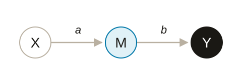
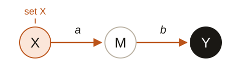

::: {.page}
::: {.hero}
<p class="eyebrow">TWO GOALS. DIFFERENT QUESTIONS.</p>

# A prediction ranking does not tell us where to intervene.

<p class="lede">A model can predict an outcome using a measured mediator while giving an upstream cause little credit. Changing that cause can still change the outcome.</p>

<p class="hero-route">Start with a simple chain. Then follow the idea into a NASA-topology simulation.</p>
:::

::: {.panel .goals-panel #goals}
<p class="eyebrow">01 / THE DISTINCTION</p>

## Same chain. Two questions.

<p class="deck">X influences an outcome Y through a mediator M. In this unconfounded example, M is measured without error and carries the entire effect of X.</p>

```{=html}
<div class="goal-grid">
  <section class="goal prediction">
    <p class="goal-kind">Prediction</p>
    <h3>What does the model use?</h3>
    
    <div class="node-labels" aria-hidden="true"><span>cause</span><span>mediator</span><span>outcome</span></div>
    <p class="figure-answer">Once M is known, X adds no predictive information.</p>
    <p>An ideal predictor can use M alone. Model-interventional SHAP then gives the unused X zero credit.</p>
  </section>
  <section class="goal intervention">
    <p class="goal-kind">Intervention</p>
    <h3>What changes if we set X?</h3>
    <div class="propagation-scene" id="propagation-scene">
      
      <svg class="motion-overlay" viewBox="0 0 480 150" aria-hidden="true" focusable="false">
        <circle class="propagation-pulse" r="5" fill="#bb541a" stroke="#fbf9f5" stroke-width="2"/>
        <circle class="propagation-halo" data-at="mediator" cx="240" cy="85" r="36"/>
        <circle class="propagation-halo" data-at="outcome" cx="410" cy="85" r="36"/>
      </svg>
    </div>
    <div class="node-labels" aria-hidden="true"><span>change here</span><span>propagate</span><span>measure here</span></div>
    <p class="figure-answer">Changing X can still change Y through M.</p>
    <p>With linear coefficients a and b, a one-unit change in X changes the expected Y by ab.</p>
    <button class="motion-control" type="button" data-motion="propagation" aria-controls="propagation-scene" hidden>Replay change</button>
  </section>
</div>
```

<p class="takeaway">Predictive credit describes a model. Choosing an action needs a causal model of what would change.</p>

<details class="math-note">
<summary>The algebra and the limits of this example</summary>

For $M = aX + \varepsilon_M$ and $Y = bM + \varepsilon_Y$, with independent errors,

$$Y \perp X \mid M, \qquad \frac{\partial}{\partial x}\mathbb E[Y \mid do(X=x)] = ab.$$

Conditional SHAP can still credit X through its association with M. Noisy mediators, additional paths and fitted-model behavior can change the predictive ranking. This example is not a universal rule that credit goes downstream. [Why the distinction matters](https://github.com/ahhatype/causal-shap-spaceflight-renal-stones/blob/main/docs/framing/prediction-vs-intervention.md).

</details>
:::

::: {.panel #depth}
<p class="eyebrow">02 / WHY CANDIDATES GET MISSED</p>

## A cause can matter and still be hard to see.

<p class="deck">Screening-off is one reason an ancestor can disappear from a predictive ranking. Attenuation is another challenge: along a chain of coefficients smaller than one in magnitude, effects shrink with each extra link.</p>

```{=html}
<div class="depth-grid">
  <figure class="depth-effects">
    <h3>More links, smaller effects</h3>
    <p class="figure-subtitle">Standardized chain · 0.6 per edge</p>
    <svg class="depth-chain-sketch" id="depth-chain-sketch" viewBox="0 0 450 76" role="img" aria-labelledby="depth-sketch-title">
      <title id="depth-sketch-title">Each added upstream link multiplies the total effect by 0.6. The outcome stays at the right.</title>
      <g class="depth-link" data-depth="5"><path d="M37 34Q58 32 80 34 M74 30L80 34L74 38"/><circle cx="20" cy="34" r="15"/><text x="20" y="40">5</text></g>
      <g class="depth-link" data-depth="4"><path d="M116 34Q138 32 161 34 M155 30L161 34L155 38"/><circle cx="99" cy="34" r="15"/><text x="99" y="40">4</text></g>
      <g class="depth-link" data-depth="3"><path d="M197 34Q220 32 242 34 M236 30L242 34L236 38"/><circle cx="180" cy="34" r="15"/><text x="180" y="40">3</text></g>
      <g class="depth-link" data-depth="2"><path d="M278 34Q300 32 323 34 M317 30L323 34L317 38"/><circle cx="261" cy="34" r="15"/><text x="261" y="40">2</text></g>
      <g class="depth-link" data-depth="1"><path d="M359 34Q381 32 403 34 M397 30L403 34L397 38"/><circle cx="342" cy="34" r="15"/><text x="342" y="40">1</text></g>
      <circle class="sketch-outcome" cx="422" cy="34" r="16"/><text class="sketch-outcome-label" x="422" y="40">Y</text>
      <text x="12" y="70" class="sketch-direction">farther upstream</text><text x="437" y="70" class="sketch-direction" text-anchor="end">outcome</text>
    </svg>
    <ol class="effect-bars" aria-label="Total effect by directed distance to the outcome">
      <li><span class="effect-value">0.60</span><span class="effect-track" aria-hidden="true"><span style="height:100%"></span></span><span>1 hop</span></li>
      <li><span class="effect-value">0.36</span><span class="effect-track" aria-hidden="true"><span style="height:60%"></span></span><span>2 hops</span></li>
      <li><span class="effect-value">0.22</span><span class="effect-track" aria-hidden="true"><span style="height:36%"></span></span><span>3 hops</span></li>
      <li><span class="effect-value">0.13</span><span class="effect-track" aria-hidden="true"><span style="height:21.6%"></span></span><span>4 hops</span></li>
      <li><span class="effect-value">0.08</span><span class="effect-track" aria-hidden="true"><span style="height:12.96%"></span></span><span>5 hops</span></li>
    </ol>
    <button class="motion-control" type="button" data-motion="depth" aria-controls="depth-chain-sketch" hidden>Replay: one more link</button>
    <figcaption>Total effect = 0.6<sup>depth</sup>. Across a general graph, different paths can add or cancel.</figcaption>
  </figure>
  <figure class="depth-detection">
    <h3>Smaller effects need more data</h3>
    <p class="figure-subtitle">Teaching simulation · selected depths</p>
    
    <figcaption>Detection by a marginal-slope test, over 400 replicates per sample size. This measures sampling uncertainty, not causal-discovery accuracy.</figcaption>
  </figure>
</div>
```

<p class="takeaway">Low predictive importance is not enough reason to exclude a candidate cause.</p>

<p class="section-note">The example uses linear mechanisms; it does not say the best action is always upstream. Measurement error adds estimation difficulty. <a href="assets/depth_washout.svg">View all five depths and the original simulation details</a>.</p>
:::

::: {.panel #path}
<p class="eyebrow">03 / THE WORKFLOW</p>

## Start with the goal. Then choose the work.

<p class="deck">This project uses seven steps, grouped below. A prediction analysis can stop at explaining the fitted model. An intervention analysis needs defensible causal assumptions and a separate evaluation of actions.</p>

```{=html}
<div class="goal-fork" aria-label="Two routes from the analysis goal">
  <span class="fork-origin">Your goal</span>
  <span class="fork-route prediction-route">Predict <span aria-hidden="true">→</span> explain the model</span>
  <span class="fork-route intervention-route">Intervene <span aria-hidden="true">→</span> establish structure <span aria-hidden="true">→</span> evaluate change</span>
</div>
<div class="workflow">
  <section class="workflow-phase">
    <p class="phase-label">Understand the data</p>
    <ol class="steps">
      <li><span class="step-number">01</span><div><h3>Gather</h3><p>Define the outcome, candidate variables and prior causal knowledge.</p></div></li>
      <li><span class="step-number">02</span><div><h3>Predict and explain</h3><p>Fit a predictor and inspect its SHAP ranking. Treat it as a model explanation.</p></div></li>
    </ol>
  </section>
  <section class="workflow-phase">
    <p class="phase-label">Establish the structure</p>
    <figure class="assumption-sketch">
      <svg viewBox="0 0 300 112" role="img" aria-labelledby="assumption-title assumption-desc">
        <title id="assumption-title">An unresolved edge becomes an explicitly assumed direction</title>
        <desc id="assumption-desc">An uncertain connection between A and B, followed by an arrow from A to B. The recorded assumption is that A precedes B. Time order constrains direction; it does not establish causation.</desc>
        <g class="sketch-ink"><path d="M19 41C17 17 54 18 54 40C56 65 18 65 19 41Z M100 40C99 18 135 17 136 40C138 65 98 64 100 40Z"/><path d="M57 41Q75 37 96 41" stroke-dasharray="4 5"/>
          <path d="M175 41C172 17 210 18 211 40C212 65 174 65 175 41Z M255 40C252 18 290 17 291 40C292 65 253 64 255 40Z"/><path d="M216 41Q233 39 250 41 M243 36L251 41L243 46"/>
        </g>
        <g class="sketch-text"><text x="37" y="47">A</text><text x="118" y="47">B</text><text x="194" y="47">A</text><text x="273" y="47">B</text><text x="151" y="47">→</text></g>
        <text class="sketch-question" x="76" y="31">?</text>
        <path class="sketch-annotation" d="M204 79Q212 67 227 57 M222 58l6-2-1 6"/>
        <text class="sketch-note" x="16" y="98">assumption recorded: A precedes B</text>
      </svg>
      <figcaption>Time order constrains an arrow; it does not prove a causal link.</figcaption>
    </figure>
    <ol class="steps" start="3">
      <li><span class="step-number">03</span><div><h3>Discover</h3><p>Test which structures the data support. Keep unresolved edges explicit.</p></div></li>
      <li class="proposed-step"><span class="step-number">04</span><div><h3>Cast wider, then filter</h3><span class="status-tag">Placeholder</span><p>Reconsider discarded candidates and flag possible noise. The proposed detector and filter have no results yet.</p></div></li>
      <li><span class="step-number">05</span><div><h3>Resolve</h3><p>Record temporal and biological constraints. Our expert-loop rounds two and three currently use a scripted heuristic.</p></div></li>
    </ol>
  </section>
  <section class="workflow-phase">
    <p class="phase-label">Attribute and evaluate</p>
    <ol class="steps" start="6">
      <li><span class="step-number">06</span><div><h3>Propagate</h3><p>Compute structural attribution using interventions propagated through the assumed graph.</p></div></li>
      <li class="proposed-step"><span class="step-number">07</span><div><h3>Evaluate candidate actions</h3><span class="status-tag">Not evaluated here</span><p>Estimate each feasible action's benefit, uncertainty and cost. A Shapley value is not that benefit.</p></div></li>
    </ol>
  </section>
</div>
```

<p class="section-note">These are this project's steps, not a requirement to fit SHAP before every causal analysis. Discovery depends on its assumptions, data types and signal strength; linearity alone cannot identify a graph. Robustness checks run across the workflow. <a href="https://github.com/ahhatype/causal-shap-spaceflight-renal-stones/tree/main/docs/playbook">Read the full playbook</a>.</p>
:::

::: {.panel #evidence}
<p class="eyebrow">04 / THE EVIDENCE</p>

## What the simulations show.

<p class="deck">NASA supplies the renal-stone topology. We choose the simulation coefficients, giving each testbed a known total-effect answer key. These are simulation results, not measured astronaut effects.</p>

```{=html}
<div class="evidence-groups">
  <section class="evidence-group">
    <div class="testbed-heading"><h3>Teaching case</h3><span>5-node stress test</span></div>
    <div class="finding"><p class="finding-number">45.6%<small>of ordinary SHAP mass</small></p><div><h4>Prediction can credit a non-cause.</h4><p>A node caused by the outcome receives this credit despite having zero total effect. A deliberately pedagogic example.</p></div></div>
  </section>
  <section class="evidence-group">
    <div class="testbed-heading"><h3>Working subgraph</h3><span>14 nodes · diagnostics</span></div>
    <div class="finding"><p class="finding-number">Model dependent<small>direction of misplaced credit</small></p><div><h4>The ranking follows the fitted model.</h4><p>One chain gives a parent almost no credit; on another, four of five model–explainer pairings shift credit toward the parent. One seed.</p></div></div>
    <div class="finding"><p class="finding-number">0 edges<small>adjacent to the outcome</small></p><div><h4>A discovery configuration disconnects Y.</h4><p>At n = 1,000, Gaussian PC leaves the binary outcome isolated. Discovery-based Causal SHAP returns all zeros. One seeded diagnostic, not a general verdict on PC.</p></div></div>
    <div class="finding"><p class="finding-number">τ 0.714<small>rank agreement with truth</small></p><div><h4>Attribution depends on the supplied graph.</h4><p>After a scripted heuristic standing in for expert review reconnects the outcome, agreement improves from an undefined τ. One seed; not human expert validation.</p></div></div>
  </section>
  <section class="evidence-group">
    <div class="testbed-heading"><h3>Source DAG</h3><span>51 nodes · NASA-topology simulation</span></div>
    <div class="finding"><p class="finding-number">0.506 / 0.528<small>Kendall's τ · ordinary / ordering-only</small></p><div><h4>No detected difference in the matched comparison.</h4><p>The paired-bootstrap interval for the difference includes zero. Restricting feature order is distinct from propagating interventions.</p></div></div>
    <div class="finding prototype-finding"><p class="finding-number">τ 0.794<small>structural propagation prototype</small></p><div><h4>A promising result that needs replication.</h4><p>Top-five recovery is 1.00. This 32×32×32 prototype uses one configuration, with no repeated-seed uncertainty.</p></div></div>
  </section>
</div>
```

<p class="section-note">Kendall's τ measures rank agreement with the frozen total-effect truth within each testbed. <a href="https://github.com/ahhatype/causal-shap-spaceflight-renal-stones/blob/main/docs/full_dag/RESEARCH_RECORD.md">Full-DAG results</a> · <a href="https://github.com/ahhatype/causal-shap-spaceflight-renal-stones/blob/main/docs/step04_results.md">Working-subgraph attribution</a> · <a href="https://github.com/ahhatype/causal-shap-spaceflight-renal-stones/blob/main/docs/step06_results.md">Scripted expert-loop results</a>.</p>
:::

::: {.panel #claims}
<p class="eyebrow">05 / WHAT REMAINS OPEN</p>

## A prototype, with visible limits.

```{=html}
<div class="status-grid">
  <section class="status-item"><h3>Established in these testbeds</h3><p>Predictive credit can miss causal relevance. Ordering-only attribution shows no detected improvement in the matched full-DAG comparison.</p></section>
  <section class="status-item"><h3>Provisional</h3><p>Structural propagation needs larger runs and repeated seeds. The scripted expert loop still needs human review. The Heskes-style value function has not run on the working subgraph.</p></section>
  <section class="status-item claim-placeholder"><h3>Proposed, not evaluated</h3><p>The detector and filter remain placeholders. Experiments E1–E3, the nonlinear-generator sweep and the decision layer have not been evaluated here.</p></section>
</div>
```
:::
:::
